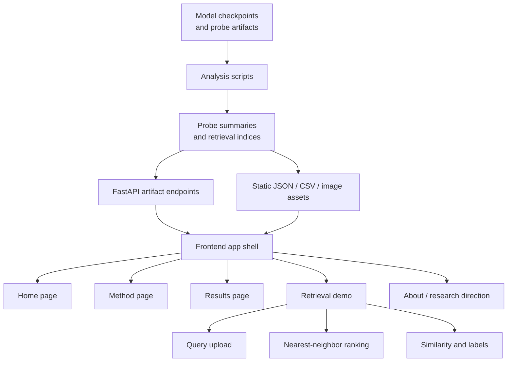
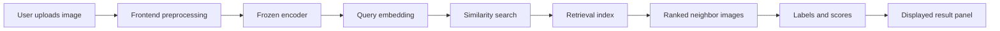
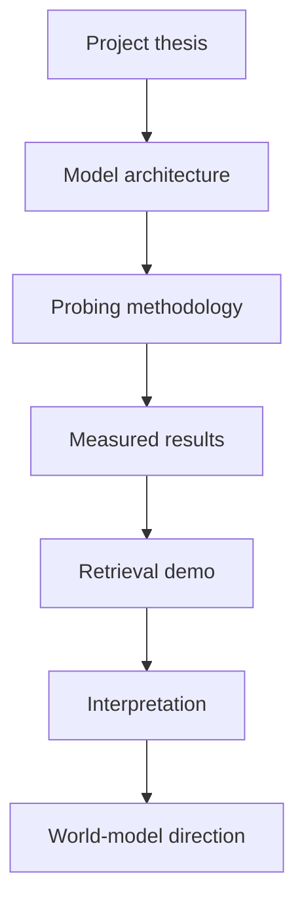
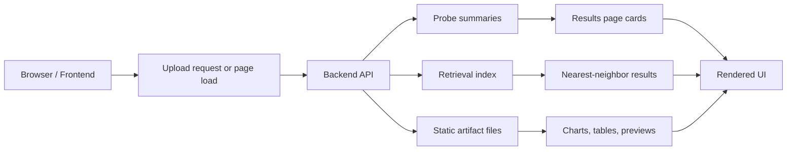
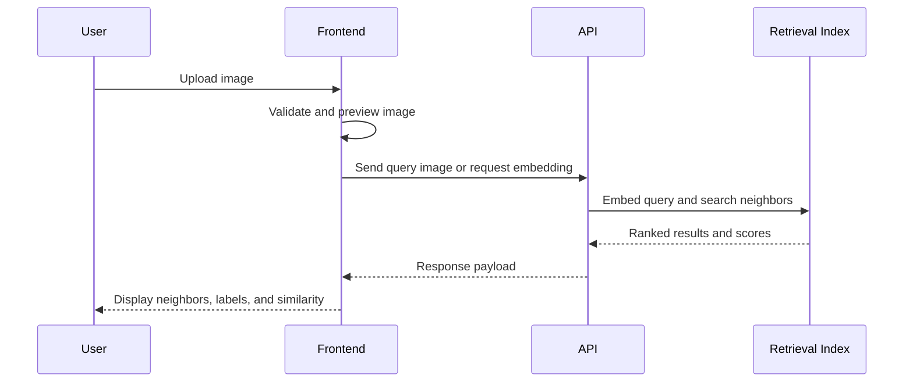
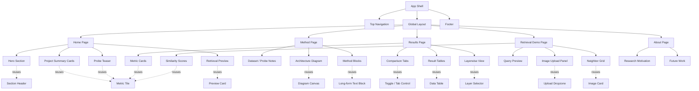

# Frontend Architecture

## Purpose

This document defines the frontend for the project as a research-facing web
experience. The goal is not to build a generic product site. The goal is to
present the work like a serious visual learning and representation research
artifact that can be shown to a hiring manager, an imaging team, or a research
lab.

The frontend should make three things obvious:

1. what the model is
2. how the representation is evaluated
3. why the results matter

The site should feel like a polished research essay with an interactive layer.

## Product Thesis

The project sits in a useful middle ground:

- it is more rigorous than a toy demo
- it is more approachable than a raw training repo
- it is more credible than a marketing landing page
- it is more inspectable than a static paper summary

The frontend should therefore behave like a hybrid of:

- technical blog
- research dashboard
- model inspection tool
- interactive demo

The main audience is a person who wants to understand both the method and the
evidence quickly.

## High-Level Stack

Recommended stack:

- **Astro** for the overall site shell and content-heavy pages
- **MDX** for research pages, methodology, and narrative sections
- **React islands** for interactive retrieval and comparison components
- **FastAPI** for any backend endpoints that serve model outputs or cached
  artifacts
- **TypeScript** for frontend logic

Why this stack:

- Astro is strong for content-first, fast-loading pages
- MDX keeps the research narrative close to the codebase
- React islands let the demo stay interactive without turning the whole site
  into an app shell
- FastAPI keeps the serving layer explicit and easy to reason about

This is the right balance if the site is meant to signal technical judgment.

## Information Architecture

The site should have a small number of intentional pages:

### 1. Home

Purpose:

- introduce the project quickly
- summarize the model, evaluation, and demo
- direct the visitor into the most important evidence

Content:

- one-sentence project thesis
- short model summary
- probe summary cards
- retrieval preview
- link to methodology

### 2. Method

Purpose:

- explain the representation learning setup
- explain probing and retrieval
- clarify what is frozen and what is trained

Content:

- model overview
- encoder vs projector explanation
- data pipeline
- probing methodology
- evaluation philosophy

### 3. Results

Purpose:

- show measured evidence
- make performance easy to scan
- separate raw metrics from interpretation

Content:

- linear probe table
- low-shot table
- k-NN table
- layerwise summary
- comparison views for encoder vs projector

### 4. Retrieval Demo

Purpose:

- let a user upload an image
- show nearest neighbors from the embedding space
- make the latent space visually inspectable

Content:

- image upload
- query preview
- ranked nearest neighbors
- similarity scores
- optional label display

### 5. About / Research Direction

Purpose:

- explain why this work is interesting
- connect the project to broader latent representation and world-model ideas
- keep the tone scholarly, not promotional

Content:

- project motivation
- short research direction statement
- future work

## Block Diagrams

### 1. Frontend System Block Diagram

This diagram shows the main layers of the site and how content flows from the
model artifacts into the user-facing experience.

### 2. Retrieval Interaction Block Diagram

This diagram shows the user-facing retrieval loop from uploaded image to
ranked visual evidence.

### 3. Research Narrative Block Diagram

This diagram explains how the site tells the story of the project.

## Content Principles

The frontend should read as if it was written for a technically literate
visitor. That means:

- explain concepts directly
- avoid hype language
- prefer measured claims
- show evidence near the explanation
- keep each section short enough to scan

The copy should not oversell the model. It should describe the setup and let the
results do the work.

## Visual Direction

The visual style should feel like a research publication with a modern product
layer.

Recommended characteristics:

- generous spacing
- strong typography hierarchy
- restrained color palette
- clear metric cards
- explicit section labels
- diagram-driven explanation

The UI should feel intentional rather than generic.

### Visual Tone

- polished
- technical
- calm
- editorial
- high-trust

### Avoid

- default startup purple gradients
- generic SaaS dashboard chrome
- flashy background effects
- noisy iconography
- overly rounded "consumer app" surfaces

## Layout System

### Desktop

- one strong hero section
- two-column layout for method and results where useful
- full-width diagram sections for architecture
- grid-based metric cards
- constrained reading width for long-form text

### Mobile

- single-column stacking
- reduced diagram complexity
- compact metric cards
- sticky actions only if they remain unobtrusive

### Reading Width

Long-form content should stay within a comfortable text column. This matters
because the site has a documentation and research tone, not a dense dashboard
tone.

## Core UI Components

### Hero Section

Contains:

- project title
- one-line thesis
- primary call to action
- quick result summary

This is the first impression, so it should be minimal and sharp.

### Metric Cards

Use for:

- linear probe accuracy
- low-shot accuracy
- k-NN accuracy
- layerwise highlights

Cards should be visually consistent and easy to compare.

### Architecture Diagram

Use a diagram to explain:

- image input
- encoder
- projector
- frozen feature bank
- probe
- retrieval

The diagram should not just be decorative. It should map cleanly onto the code
and documentation.

### Retrieval Panel

Use for:

- image upload
- preview of query image
- ranked neighbor thumbnails
- similarity scores
- label display

This is the most important interactive component in the site.

### Comparison Tabs

Use for:

- encoder vs projector
- different probe fractions
- different layers
- different checkpoints

Tabs should preserve layout and only swap the content that changes.

## Motion System

Motion should be used to clarify structure, not to entertain.

The default experience should feel calm, deliberate, and research-oriented.

### Motion Principles

- use motion to reveal relationships
- keep animations short and subtle
- prefer entrance motion over loops
- keep the same motion language across the site
- avoid effects that pull attention away from the evidence

### Recommended Animation Budget

Use animation in only a few places:

- page and section entrances
- architecture diagram transitions
- metric card hover states
- retrieval result arrival
- comparison state changes

Everything else should remain still.

### Motion Spec

| Surface | Motion | Duration | Easing | Purpose |
|---|---|---:|---|---|
| Hero title | Fade + rise | 450-600 ms | `cubic-bezier(0.2, 0.8, 0.2, 1)` | Set the pace |
| Section headers | Fade + slight translate | 250-350 ms | `ease-out` | Guide reading order |
| Metric cards | Soft lift on hover | 150-200 ms | `ease-out` | Suggest interactivity |
| Retrieval thumbnails | Staggered fade-in | 250-400 ms | `ease-out` | Make ranking readable |
| Diagram nodes | State transition | 300-500 ms | `ease-out` | Explain the pipeline |
| Tabs | Crossfade + slide | 200-300 ms | `ease-out` | Compare modes cleanly |

### Animation Patterns

#### 1. Intro sequence

The homepage should appear in a controlled sequence:

1. headline
2. short supporting line
3. summary cards
4. result teaser
5. retrieval preview

This creates a sense of deliberate progression.

#### 2. Scroll-triggered reveals

Method and results sections should reveal as they enter the viewport. This is
especially effective for:

- methodology blocks
- probe explanations
- architecture callouts
- result summaries

The reveal should happen once and stay stable.

#### 3. Retrieval interaction motion

When a user uploads an image:

- the query card should settle into place
- a lightweight loading state should appear
- neighbors should animate in ranked order
- the best match should receive gentle emphasis

This is the most important motion sequence because it turns the embedding space
into something the user can inspect.

#### 4. Comparison motion

For encoder vs projector and layerwise views:

- use tabs or segmented controls
- preserve layout dimensions when switching
- animate only the content change

This keeps comparisons readable.

### Implementation Guidance

- Use CSS transitions for hover and simple state changes.
- Use a small animation library only where sequencing matters.
- Use SVG or CSS animation for simple diagram motion.
- Respect `prefers-reduced-motion`.
- Keep motion consistent in light and dark themes.

### What Not To Animate

- continuously moving backgrounds
- decorative particles
- exaggerated parallax
- repeated bouncing or pulsing
- every card on every page

Those patterns weaken the research signal.

## Color and Typography

### Color Strategy

Use a restrained palette:

- one primary accent
- one secondary accent
- neutral background and surface tones
- clear success/warning colors for metrics only if needed

The color system should support legibility more than brand expression.

### Typography Strategy

Use a strong editorial pairing:

- one display face for headlines
- one highly readable text face for body copy and tables

The type should feel technical and clear, not trendy.

## Data and API Contract

The frontend should not guess at model outputs. It should consume structured
artifacts generated by the backend and analysis scripts.

Expected data sources:

- probe summary JSON
- probe result CSVs
- retrieval index artifacts
- query result payloads
- image metadata and labels

Recommended frontend contract:

- a summary endpoint for headline metrics
- a retrieval endpoint for query results
- a static artifact path for charts and tables

Keep the contract narrow so the UI remains stable even if the model pipeline
changes.

## Accessibility

The site should be accessible by default:

- maintain semantic headings
- keep contrast high
- provide alt text for images and thumbnails
- make keyboard navigation functional
- do not rely on color alone to communicate state
- respect reduced-motion preferences

Accessibility matters here because the content is explanatory and dense.

## Performance

This frontend should load quickly even with rich content.

Rules:

- keep the initial shell light
- defer heavy interactive code until needed
- lazy-load retrieval components
- avoid unnecessary client-side state
- pre-render documentation pages

The result should feel fast enough to preserve the credibility of the research.

## Deployment Model

Recommended deployment shape:

- static frontend deployed separately
- model-serving backend deployed behind a stable API
- artifact storage for cached embeddings, results, and preview assets

This separation helps with:

- iteration speed
- reliability
- reproducibility
- easier hosting

## Build Order

1. Finalize content structure and page routing.
2. Implement the design tokens and page shell.
3. Add the research narrative pages.
4. Wire in probe results from generated artifacts.
5. Add retrieval demo interactions.
6. Layer in motion and accessibility passes.
7. Deploy and verify performance.

## Success Criteria

The frontend is successful if a visitor can do all of the following quickly:

- understand what the model is
- see why the probing is meaningful
- inspect retrieval behavior
- compare encoder and projector spaces
- connect the work to broader latent-model research

If the site accomplishes that, it is doing its job.

## Final Positioning

The best version of this frontend is not flashy. It is clear, credible, and
visually memorable in a restrained way.

It should feel like:

- a technical essay
- an interactive experiment
- a polished research portfolio piece

That is the right signal for imaging and vision hiring managers.

## Data-Flow and Sequence Diagrams

### 1. Frontend Data-Flow Diagram

This diagram shows how data moves between the browser, the backend, and the
cached artifacts used by the frontend.

### 2. Retrieval Sequence Diagram

This diagram shows the runtime order of events when a user uploads an image and
asks for nearest neighbors.

## Frontend Page / Component Block Diagram

This diagram shows the frontend as a modular interface system. It separates the
pages a visitor navigates between from the reusable components that make those
pages consistent.

