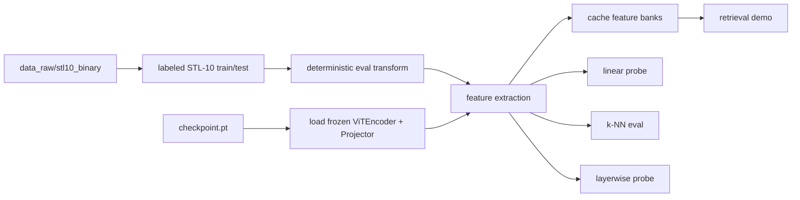

# Probing Pipeline and Retrieval Demo

## Overview

This repository trains a self-supervised ViT encoder on unlabeled STL-10 with
VICReg. Probing asks a separate question:

> How much class information is already present in the frozen representation?

The answer is measured by freezing the encoder, extracting embeddings for the
labeled STL-10 split, and training a linear classifier on top of those frozen
features. If the representation is useful, a linear head should be able to
separate the classes well. If the representation is weak or collapsed, a linear
head cannot recover the missing structure.

The same frozen embedding pipeline also powers the nearest-neighbor retrieval
demo. That means the offline evaluation and the hosted image upload demo reuse
the same feature extraction code and the same checkpoint.

## What Is Being Probed

The default probe uses the final encoder embedding, not the projector output.
That is the standard representation-quality evaluation in SSL:

- **encoder features**: the main transfer representation
- **projector features**: an auxiliary comparison space
- **layerwise features**: optional diagnostic view across transformer depth

The projector is trained to satisfy VICReg geometry. It is useful for the
training objective, but it is not necessarily the best transfer embedding. That
is why the encoder output is the default probe target.

## Data Source

The probe uses the labeled STL-10 binary files already present in:

- `data_raw/stl10_binary/train_X.bin`
- `data_raw/stl10_binary/train_y.bin`
- `data_raw/stl10_binary/test_X.bin`
- `data_raw/stl10_binary/test_y.bin`

There is no second download path and no conversion step. The same repository
already holds the raw labeled data required for evaluation.

This was verified in the workspace and used successfully by the probing
pipeline.

The labels in the official STL-10 files are remapped to standard zero-based
class indices for classification:

- airplane
- bird
- car
- cat
- deer
- dog
- horse
- monkey
- ship
- truck

## Methodology

### 1. Freeze the encoder

The VICReg checkpoint is loaded and the encoder is switched to eval mode.
During probing, the encoder does not receive gradients and its weights are not
updated.

Why this matters:

- probing should measure what the representation already contains
- fine-tuning would confound representation quality with classifier capacity
- a linear probe is only useful if the backbone stays fixed

### 2. Extract features

Each labeled STL-10 image is passed through the same deterministic evaluation
transform:

- resize to 96 x 96
- convert to tensor
- normalize with ImageNet channel statistics

The pipeline then computes:

- `encoder` features: `ViTEncoder(image)`
- `projector` features: `Projector(ViTEncoder(image))`
- `layer_i` features: mean-pooled hidden state after transformer block `i`

The feature extraction step is shared across all downstream measurements.

### 3. Train a linear probe

The linear probe is a single `nn.Linear` layer trained with cross-entropy on the
frozen features.

There are no hidden layers, no feature engineering, and no end-to-end encoder
updates.

This is the standard evaluation because it answers a narrow question:

- can the class structure be read out linearly from the representation?

The probe is trained on the labeled STL-10 train split and evaluated on the
STL-10 test split.

### 4. Low-shot evaluation

To see how robust the representation is when labels are scarce, the probe is
also trained on balanced label fractions:

- 1%
- 10%
- 100%

The low-shot protocol uses a class-balanced subset so the result is not skewed
by sampling too many examples from one class. This is useful for judging how
label-efficient the learned representation is.

### 5. k-NN sanity check

Before training a classifier, the same embeddings are evaluated with cosine k-NN
classification.

This is a fast sanity check for two reasons:

- it requires no trained head
- it measures whether nearby points already share labels

If k-NN is strong, the embedding space already has local class structure. If
linear probing is strong but k-NN is weak, the representation may be more
globally separable than locally clustered.

### 6. Layerwise probing

The probe suite also extracts hidden states after each transformer block and
fits a linear classifier on each layer independently.

This answers:

- at what depth do class-relevant features emerge?
- does the representation improve monotonically with depth?
- is the final layer actually the best one for transfer?

Layerwise probing is a diagnostic, not the primary headline metric, but it helps
explain how the encoder is organizing information internally.

## Why These Metrics Are Different

The full evaluation suite covers different failure modes:

- **linear probe accuracy**: overall transfer quality
- **low-shot accuracy**: label efficiency
- **k-NN accuracy**: local neighborhood structure
- **layerwise accuracy**: where semantics appear in the network

A single number is not enough. A representation can look decent under one metric
and weak under another. Using all four gives a more complete picture.

## Caching Strategy

The probing script now caches feature banks so repeated runs do not recompute
embeddings.

Cache layout:

- `logs/probing/feature_banks/encoder_train.pt`
- `logs/probing/feature_banks/encoder_test.pt`
- `logs/probing/feature_banks/projector_train.pt`
- `logs/probing/feature_banks/projector_test.pt`

Each cache entry stores:

- the feature tensor
- the labels
- the original dataset indices
- the feature-space name
- the split name

Why cache at the feature-bank level:

- probing typically reruns many times while tuning the classifier
- the encoder is the expensive part, not the linear head
- retrieval and probing both benefit from the same cached embeddings

The script supports:

- reuse existing caches by default
- `--refresh-cache` to recompute embeddings

## Current Pipeline



## Outputs

The probing run writes:

- `logs/probing/probe_summary.json`
- `logs/probing/probe_results.csv`
- `logs/probing/knn_results.csv`
- `logs/probing/layerwise_results.csv`
- `logs/probing/retrieval_index_encoder.pt`
- `logs/probing/retrieval_index_projector.pt`
- `logs/probing/feature_banks/*.pt`

## How To Run

Probe and cache embeddings:

```powershell
uv run python scripts/run_probing.py --checkpoint checkpoints/vicreg/best.pt
```

Force recomputation of cached embeddings:

```powershell
uv run python scripts/run_probing.py --checkpoint checkpoints/vicreg/best.pt --refresh-cache
```

Launch the retrieval demo:

```powershell
uv run python scripts/serve_retrieval_demo.py --checkpoint checkpoints/vicreg/best.pt
```

## Current Results

Measured from the latest probe run on `checkpoints/vicreg/best.pt`:

| Feature space | Fraction | Train acc | Test acc | k-NN acc |
|---|---:|---:|---:|---:|
| Encoder | 1% | 1.0000 | 0.5950 |  |
| Encoder | 10% | 0.9380 | 0.7266 |  |
| Encoder | 100% | 0.8574 | 0.7953 | 0.7481 |
| Projector | 1% | 1.0000 | 0.5265 |  |
| Projector | 10% | 1.0000 | 0.6725 |  |
| Projector | 100% | 0.8226 | 0.7564 | 0.7418 |

Interpretation:

- the encoder is the better transfer space
- the projector is slightly worse, which is expected
- k-NN is already strong, which means the embedding space has good local
  neighborhood structure
- the representation is clearly non-collapsed and linearly readable

## Retrieval Demo Behavior

The retrieval UI, whatever frontend is chosen later, should use the same frozen
checkpoint and embedding space.

User flow:

1. upload an image
2. normalize it with the same eval transform
3. embed it with the frozen model
4. retrieve the nearest labeled STL-10 examples
5. display thumbnails, labels, and similarity scores

This is useful because it makes the representation visually inspectable, not
just numerical.

## Why This Matters For World Models

This probing and retrieval setup is still representation learning, not a full
world model. But it is a good foundation for one:

- it learns a compact latent state
- it tests whether the latent state is semantically organized
- it exposes the learned geometry through retrieval
- it preserves a clean separation between representation learning and
  downstream evaluation

That is aligned with the broader direction of latent-space world modeling:
learn useful internal state first, then build prediction and planning on top.
