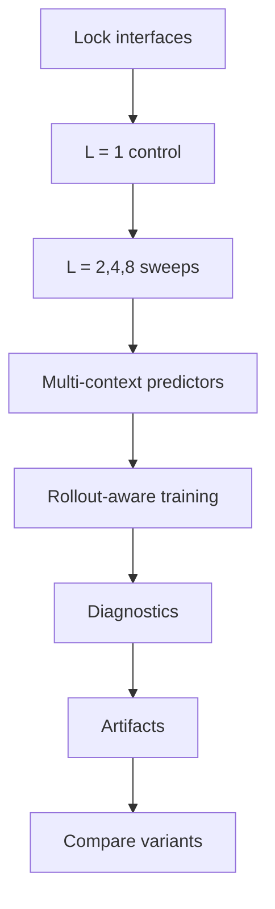

# Plan: Improving Temporal Predictor

## 1. Objective

Implement the next predictor-focused iteration of the latent video dynamics system.

The plan should move in small, validated steps:

1. confirm the one-lag path,
2. introduce stronger predictors behind the same interface,
3. compare lag lengths (`L = 1, 2, 4, 8, ...`),
4. compare rollout-aware objectives,
5. retain the diagnostics and plots needed to explain the result.

## 2. Execution Order

Do not skip steps.

### Step 1: Lock the interface

- Confirm encoder, cache, and predictor contracts.
- Keep the encoder frozen.
- Keep predictor inputs and outputs explicit.

### Step 2: Implement the lag control

- Add a lag-length parameter `L`.
- Use `L = 1` as the one-lag sanity-check baseline.
- Verify that `L = 2` and larger windows can be trained, evaluated, and plotted.

### Step 3: Add the multi-context predictor

- Support a context window of `C > 1`.
- Make the context lag length configurable via a numeric parameter.
- Keep the predictor pluggable.

### Step 4: Add rollout-aware training

- Support teacher-forced loss.
- Support rollout loss.
- Support multi-horizon weighting.
- Support mixed or scheduled rollout training if enabled.

### Step 5: Add diagnostics

- log MSE,
- log normalized MSE,
- log cosine similarity,
- log the combined loss separately from its components,
- log per-horizon rollout error,
- log drift and alignment,
- log baseline comparisons,
- log singular-spectrum summaries.

### Step 6: Save artifacts automatically

- save checkpoints,
- save plots,
- save metrics,
- save validation JSON,
- save profiler output when requested.

### Step 7: Compare variants

- compare one-lag vs multi-context,
- compare different context lengths,
- compare different predictors if the code path supports them.

## 3. Implementation Shape

The predictor implementation should be organized around a shared interface:

```text
context_latents -> future_latents
```

The evaluation harness should not care whether the predictor is a transformer, Mamba, TCN, or recurrent model.

The training loop should only depend on:

- `encode`
- `predict`
- `loss`
- `validate`
- `plot`

## 4. Artifact Layout

Each run should write to a dedicated output directory, for example:

```text
logs/<encoder>-<predictor>/
```

with subfolders such as:

```text
metrics/
plots/
profile/
checkpoints/
cache/
```

## 5. Rollout Evaluation

The run should compute both teacher-forced and free-rollout predictions.

For each horizon `r`, report:

$$
\varepsilon_r^{\mathrm{TF}} = z_{t+r} - \hat{z}_{t+r}^{\mathrm{TF}}
$$

$$
\varepsilon_r^{\mathrm{RO}} = z_{t+r} - \hat{z}_{t+r}^{\mathrm{RO}}
$$

and the drift term:

$$
d_r = \hat{z}_{t+r}^{\mathrm{TF}} - \hat{z}_{t+r}^{\mathrm{RO}}.
$$

The plan must preserve the identity:

$$
\varepsilon_r^{\mathrm{RO}} = \varepsilon_r^{\mathrm{TF}} + d_r.
$$

## 6. Validation Gate

Do not merge until:

- the one-lag baseline is reproducible,
- the multi-context predictor trains successfully,
- rollout validation is generated,
- plots are saved,
- baseline comparisons are visible,
- the result is interpretable from saved artifacts alone.

## 7. Mermaid View


