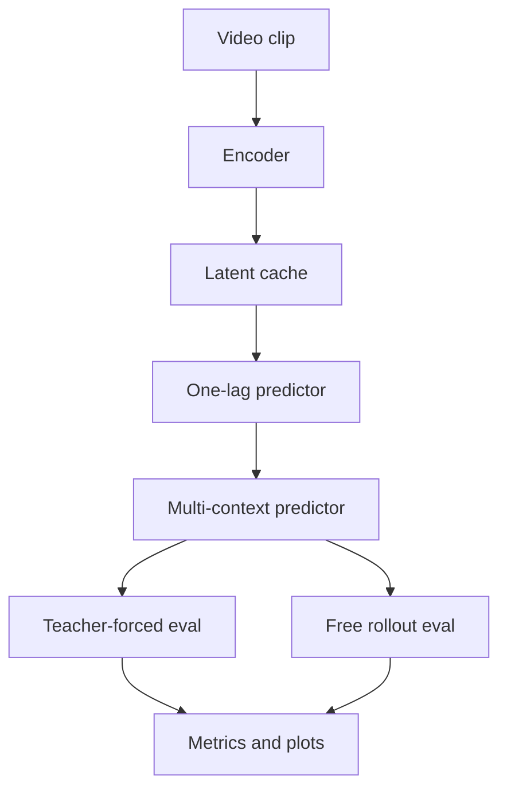

# Requirements: Improving Temporal Predictor

## 1. Goal

The objective is to improve the temporal predictor for latent video dynamics while keeping the encoder fixed.

The feature should answer:

1. Can a stronger predictor beat the current baseline?
2. How much of the gain comes from one-lag memory versus broader context?
3. How does rollout error evolve with horizon?
4. Which training objective best reduces drift under free rollout?

## 2. Non-Goals

This feature does not primarily target:

- encoder redesign,
- pixel-level reconstruction quality,
- classification performance,
- unstructured model sweeps without diagnostics,
- changing the core latent cache format unless required for compatibility.

## 3. Operating Assumptions

- The encoder is frozen.
- Latents are loaded from a reproducible cache.
- The predictor is pluggable.
- The evaluation pipeline must compare against trivial baselines.
- All metrics and plots must be written to disk automatically.

## 4. Core Mathematical Contract

Let a video clip be encoded as a latent sequence:

$$
z_{1:T} = (z_1, z_2, \ldots, z_T), \qquad z_t \in \mathbb{R}^d.
$$

Let the context length be `C` and the forecast horizon be `F`.

The predictor should learn:

$$
\hat{z}_{t+1:t+F} = f_\theta(z_{t-C+1:t}).
$$

For the one-lag ablation, the input is only the most recent latent:

$$
\hat{z}_{t+1} = f_\theta(z_t).
$$

For rollout, predictions are fed back recursively:

$$
\hat{z}_{t+r+1} = f_\theta(z_{t-C+2+r:t+r})
$$

where the context window contains predicted latents after the first step.

## 5. Required Interfaces

### 5.1 Encoder Interface

The encoder remains a black box with the following contract:

$$
\mathrm{encode}(x_{1:T}) \rightarrow z_{1:N}
$$

where:

- `x_{1:T}` is a video clip,
- `z_{1:N}` is a latent trajectory,
- `N` depends on the encoder stride / tubelet size.

The encoder must expose metadata:

- latent dimension,
- clip length,
- tubelet size or temporal stride,
- input image size,
- checkpoint fingerprint.

### 5.2 Predictor Interface

The predictor contract is:

$$
\mathrm{predict}(z_{t-C+1:t}) \rightarrow \hat{z}_{t+1:t+F}
$$

The predictor must support:

- one-lag mode,
- multi-context mode,
- autoregressive rollout,
- teacher-forced evaluation,
- batch inference.

### 5.3 Latent Cache Contract

Each cached sample must store:

- sample id,
- split name,
- source path,
- encoder name,
- encoder checkpoint,
- latent tensor,
- latent shape,
- latent dtype,
- context and future settings,
- frame rate,
- clip duration,
- preprocessing fingerprint.

Recommended logical schema:

```json
{
  "sample_id": "151369",
  "split": "train",
  "source_path": "data/data_videos/train/151369.webm",
  "encoder_name": "swin",
  "encoder_checkpoint": "...",
  "context_seconds": 4.0,
  "future_seconds": 2.0,
  "sample_fps": 4.0,
  "tubelet_size": 2,
  "latent_dim": 192,
  "latent_shape": [24, 192]
}
```

## 6. Predictor Candidates

The feature should support the following predictor families behind a common interface:

- causal transformer,
- Mamba / selective state space model,
- TCN,
- GRU/LSTM,
- one-lag MLP baseline.

The implementation does not need all of them at once, but the design must allow swapping without changing the evaluation harness.

The predictor must also accept a configurable lag length `L`:

$$
\hat{z}_{t+1:t+F} = f_\theta(z_{t-L+1:t}),
$$

with `L = 1` recovering the one-lag baseline and larger values giving broader temporal context.

## 7. Outputs

Each run must write:

- `result.json`
- `metrics.json`
- `predictions.csv`
- `rollout_validation.json`
- `plots/training_steps.png`
- `plots/training_history.png`
- `plots/training_components.png`
- `plots/metric_comparison.png`
- `plots/rollout_validation.png`
- `plots/rollout_spectrum.png`
- `profile/profile_summary.json` when profiling is enabled
- `profile/video_world_model_trace.json` when profiling is enabled
- a run summary that records per-step loss terms, per-epoch loss terms, rollout drift terms, alignment terms, and singular-spectrum summaries

## 8. Success Criteria

This feature is successful if:

1. the one-lag baseline is implemented and measurable,
2. the context-window predictor is pluggable and lag-configurable,
3. rollout validation is generated automatically,
4. the report includes baselines and horizon-wise analysis,
5. the run artifacts are stable enough to compare future experiments.

## 9. Mermaid View


