# Plan: Latent Rollout Objectives

## 1. Objective

Implement and validate the next objective-focused iteration of the latent video dynamics system.

The plan should proceed in validated steps:

1. keep the predictor and lag interface stable,
2. add objective switches for direct regression and delta prediction,
3. support multi-horizon rollout losses,
4. compare lag lengths,
5. compare predictor families,
6. retain the full diagnostics set.

## 2. Execution Order

Do not skip steps.

### Step 1: Lock the interface

- Confirm the encoder, cache, and predictor contracts.
- Keep the predictor family pluggable.
- Keep the lag/window parameter explicit.

### Step 2: Add objective switches

- Add direct latent regression.
- Add delta prediction.
- Add an objective selector in the CLI and config.
- Support `balanced`, `mse`, `normalized_mse`, `cosine`, `rollout_balanced`, `delta_balanced`, and `delta_rollout_balanced`.
- Add a rollout decay parameter for horizon weighting.
- Keep the direct losses and rollout losses available as logged metrics at train, validation, and test time.

### 2.1 Objective menu

The implementation should treat the losses as configurable contracts, not hard-coded behavior:

$$
\mathcal{L}_{\mathrm{mse}} = \ell_{\mathrm{mse}}, \qquad
\mathcal{L}_{\mathrm{norm}} = \ell_{\mathrm{norm}}, \qquad
\mathcal{L}_{\cos} = \ell_{\cos}.
$$

The mixed direct objective is:

$$
\mathcal{L}_{\mathrm{balanced}}
=
\ell_{\mathrm{norm}} + 0.1\,\ell_{\mathrm{mse}} + 0.1\,\ell_{\cos}.
$$

The rollout-weighted objective is:

$$
\mathcal{L}_{\mathrm{rollout}}
=
\sum_{r=1}^{F} w_r
\Big(
\ell_{\mathrm{norm}}(\hat{\mathbf{z}}_{r}, \mathbf{z}_{r})
+ 0.1\,\ell_{\mathrm{mse}}(\hat{\mathbf{z}}_{r}, \mathbf{z}_{r})
+ 0.1\,\ell_{\cos}(\hat{\mathbf{z}}_{r}, \mathbf{z}_{r})
\Big),
\qquad
w_r \propto \gamma^{r-1}.
$$

The delta variants replace the target with residual offsets from the last context latent `\mathbf{c} = z_t`:

$$
\Delta \hat{\mathbf{z}}_{r} = \hat{\mathbf{z}}_{r} - \mathbf{c},
\qquad
\Delta \mathbf{z}_{r} = \mathbf{z}_{r} - \mathbf{c}.
$$

At test time, these losses are not optimized but are still reported:

- direct losses measure absolute latent fit,
- rollout losses measure horizon sensitivity,
- delta losses measure motion-relative fit,
- baselines show whether the predictor is doing better than copying the last latent or averaging the context.

### Step 3: Add rollout-aware loss

- Train against multi-horizon rollout targets.
- Keep teacher-forced evaluation available.
- Log each horizon separately.
- For delta objectives, convert residual predictions back to absolute latents during evaluation so the same metrics can be compared across objective families.

### Step 4: Compare lag and model families

- Sweep lag lengths `L = 1, 2, 4, 8, ...`.
- Compare `mamba`, `causal_transformer`, `cross_attention`, and simple baselines.

### Step 5: Keep diagnostics

- log MSE,
- log normalized MSE,
- log cosine similarity,
- log combined loss separately,
- log horizon-wise rollout error,
- log drift and alignment,
- log singular spectrum,
- log baseline verdicts.

### Step 6: Save artifacts

- save checkpoints during training,
- save plots automatically,
- save rollout validation JSON,
- save profiling output when requested,
- save a readable results report in the feature folder.

## 3. Implementation Shape

The core interface should remain:

```text
context_latents -> future_latents
```

The objective layer should sit between the predictor output and the validation logic.

## 4. Artifact Layout

Each run should write into a dedicated output directory with:

```text
checkpoints/
plots/
profile/
metrics.json
result.json
rollout_validation.json
predictions.csv
```

## 5. Rollout Evaluation

For each horizon `r`, report teacher-forced and free-rollout errors, drift, alignment, and spectral summaries.

The algebra should continue to satisfy:

$$
\varepsilon_r^{\mathrm{RO}} = \varepsilon_r^{\mathrm{TF}} + d_r.
$$

## 6. Validation Gate

Do not merge until:

- the objective selector works,
- the one-lag and multi-context paths work,
- rollout validation is generated,
- plots are saved,
- baseline comparisons are visible,
- the feature can be explained from artifacts alone.

## 7. Mermaid View

```mermaid
flowchart TD
    A[Stable interface] --> B[Objective selector]
    B --> C[Direct regression]
    B --> D[Delta prediction]
    C --> E[Rollout-aware loss]
    D --> E
    E --> F[Diagnostics]
    F --> G[Artifacts]
    G --> H[Compare lag and model families]
```


