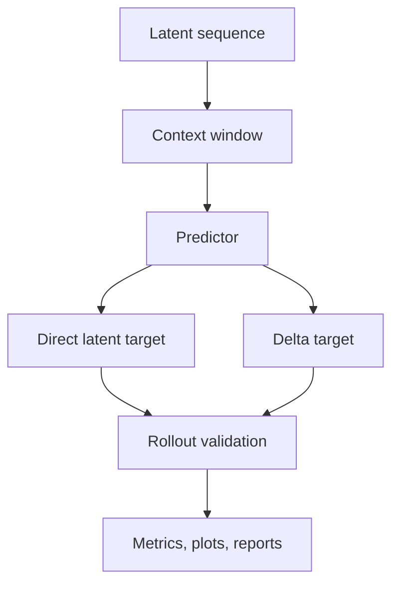

# Requirements: Latent Rollout Objectives

## 1. Goal

The goal is to improve latent rollout quality for video prediction by changing the prediction objective, not by hard-wiring the encoder.

The feature should answer:

1. Does a rollout-aware objective reduce free-rollout drift?
2. Does delta prediction help versus direct latent regression?
3. How do lag length and context size change the horizon-wise error profile?
4. Which predictor family is most stable under rollout?

## 2. Non-Goals

This feature does not primarily target:

- encoder redesign,
- pixel-space generation,
- browser UI changes,
- classification metrics,
- unstructured sweeps without saved diagnostics.

## 3. Operating Assumptions

- The latent encoder is already usable.
- The predictor remains pluggable.
- Training must continue to save checkpoints, metrics, plots, and validation artifacts.
- Baseline comparisons remain mandatory.

## 4. Mathematical Contract

Let the encoded latent trajectory be:

$$
z_{1:T} = (z_1, z_2, \ldots, z_T), \qquad z_t \in \mathbb{R}^d.
$$

Let the predictor consume a context window of length `L` and predict `F` future steps:

$$
\hat{z}_{t+1:t+F} = f_\theta(z_{t-L+1:t}).
$$

For delta prediction, the predictor may output:

$$
\Delta \hat{z}_{t+r} = \hat{z}_{t+r} - z_{t+r-1}
$$

or an equivalent residual form.

The training objective may combine:

$$
\mathcal{L}
=
\sum_{r=1}^{F}
w_r
\, \ell(\hat{z}_{t+r}, z_{t+r}),
$$

where `\ell` can include:

- MSE,
- normalized MSE,
- cosine loss,
- rollout consistency penalties,
- delta consistency penalties.

Concrete objective modes supported by the implementation:

- `balanced`
- `mse`
- `normalized_mse`
- `cosine`
- `rollout_balanced`
- `delta_balanced`
- `delta_rollout_balanced`

The rollout-weighted modes use a configurable geometric decay factor `\gamma`:

$$
w_r \propto \gamma^{r-1}.
$$

## 5. Required Interfaces

### 5.1 Predictor Interface

The predictor must support:

- one-lag input,
- multi-context input,
- autoregressive rollout,
- teacher-forced evaluation,
- batch inference,
- selectable model family.

### 5.2 Objective Interface

The training loop must support:

- direct latent regression,
- delta prediction,
- multi-horizon weighting,
- rollout-aware penalty terms,
- optional mixed teacher-forced / rollout training.

### 5.3 Artifact Interface

Each run must record:

- encoder name,
- predictor name,
- lag length,
- context seconds,
- future seconds,
- dataset split,
- subset size,
- all loss terms,
- baseline comparison,
- rollout diagnostics,
- checkpoint paths,
- plot paths.

## 6. Success Criteria

This feature is successful if:

1. the objective choice is configurable,
2. the run artifacts expose per-step, per-epoch, and per-horizon losses,
3. rollout validation stays numerically consistent,
4. at least one configuration improves over the trivial baselines,
5. the results are reproducible from saved files alone.

## 7. Mermaid View

