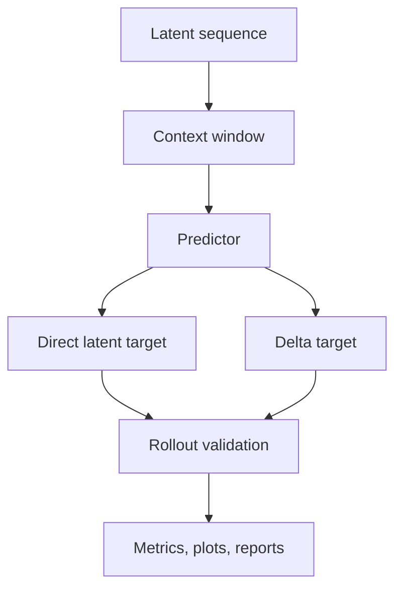

# Requirements: Latent Rollout Objectives

## 1. Goal

The goal is to improve latent rollout quality for video prediction by changing the prediction objective, not by hard-wiring the encoder.

The feature should answer:

1. Does a rollout-aware objective reduce free-rollout drift?
2. Does delta prediction help versus direct latent regression?
3. How do lag length and context size change the horizon-wise error profile?
4. Which predictor family is most stable under rollout?

## 2. Non-Goals

This feature does not primarily target:

- encoder redesign,
- pixel-space generation,
- browser UI changes,
- classification metrics,
- unstructured sweeps without saved diagnostics.

## 3. Operating Assumptions

- The latent encoder is already usable.
- The predictor remains pluggable.
- Training must continue to save checkpoints, metrics, plots, and validation artifacts.
- Baseline comparisons remain mandatory.

## 4. Mathematical Contract

Let the encoded latent trajectory be:

$$
z_{1:T} = (z_1, z_2, \ldots, z_T), \qquad z_t \in \mathbb{R}^d.
$$

Let the predictor consume a context window of length `L` and predict `F` future steps:

$$
\hat{z}_{t+1:t+F} = f_\theta(z_{t-L+1:t}).
$$

For delta prediction, the predictor may output:

$$
\Delta \hat{z}_{t+r} = \hat{z}_{t+r} - z_{t+r-1}
$$

or an equivalent residual form.

The training objective may combine:

$$
\mathcal{L}
=
\sum_{r=1}^{F}
w_r
\, \ell(\hat{z}_{t+r}, z_{t+r}),
$$

where `\ell` can include:

- MSE,
- normalized MSE,
- cosine loss,
- rollout consistency penalties,
- delta consistency penalties.

Concrete objective modes supported by the implementation:

- `balanced`
- `mse`
- `normalized_mse`
- `cosine`
- `rollout_balanced`
- `delta_balanced`
- `delta_rollout_balanced`

The rollout-weighted modes use a configurable geometric decay factor `\gamma`:

$$
w_r \propto \gamma^{r-1}.
$$

### 4.1 Direct latent regression losses

Let the flattened prediction and target vectors for a horizon step be:

$$
\hat{\mathbf{z}}_{r} \in \mathbb{R}^{d}, \qquad \mathbf{z}_{r} \in \mathbb{R}^{d}.
$$

The per-step mean-squared error is:

$$
\ell_{\mathrm{mse}}(\hat{\mathbf{z}}_{r}, \mathbf{z}_{r})
=
\frac{1}{d}\sum_{i=1}^{d}
(\hat{z}_{r,i} - z_{r,i})^2.
$$

The normalized MSE first normalizes each vector:

$$
\tilde{\mathbf{z}}_{r}
=
\frac{\mathbf{z}_{r}}{\lVert \mathbf{z}_{r} \rVert_2 + \varepsilon},
\qquad
\tilde{\hat{\mathbf{z}}}_{r}
=
\frac{\hat{\mathbf{z}}_{r}}{\lVert \hat{\mathbf{z}}_{r} \rVert_2 + \varepsilon},
$$

and then applies MSE:

$$
\ell_{\mathrm{norm}}(\hat{\mathbf{z}}_{r}, \mathbf{z}_{r})
=
\frac{1}{d}\sum_{i=1}^{d}
(\tilde{\hat{z}}_{r,i} - \tilde{z}_{r,i})^2.
$$

The cosine loss is:

$$
\ell_{\cos}(\hat{\mathbf{z}}_{r}, \mathbf{z}_{r})
=
1 -
\frac{
\hat{\mathbf{z}}_{r}^{\top}\mathbf{z}_{r}
}{
\lVert \hat{\mathbf{z}}_{r} \rVert_2 \lVert \mathbf{z}_{r} \rVert_2 + \varepsilon
}.
$$

The supported direct objectives are:

$$
\mathcal{L}_{\mathrm{mse}}
=
\ell_{\mathrm{mse}},
\qquad
\mathcal{L}_{\mathrm{norm}}
=
\ell_{\mathrm{norm}},
\qquad
\mathcal{L}_{\cos}
=
\ell_{\cos},
$$

and the balanced objective is:

$$
\mathcal{L}_{\mathrm{balanced}}
=
\ell_{\mathrm{norm}}
 + 0.1\,\ell_{\mathrm{mse}}
 + 0.1\,\ell_{\cos}.
$$

Intuition:

- `mse` penalizes absolute latent drift.
- `normalized_mse` emphasizes directional agreement on the latent sphere.
- `cosine` focuses on angular alignment and ignores global scale.
- `balanced` mixes scale, direction, and normalized structure so the predictor cannot cheat by matching only one aspect.

At test time these direct losses are not optimized, but they are still reported as metrics so we can compare models and baselines on the same geometry.

### 4.2 Rollout-weighted losses

For a prediction horizon `F`, define weights:

$$
w_r = \frac{\gamma^{r-1}}{\sum_{j=1}^{F}\gamma^{j-1}},
\qquad r=1,\dots,F.
$$

The rollout-balanced objective is:

$$
\mathcal{L}_{\mathrm{rollout}}
=
\sum_{r=1}^{F}
w_r
\Big(
\ell_{\mathrm{norm}}(\hat{\mathbf{z}}_{r}, \mathbf{z}_{r})
+ 0.1\,\ell_{\mathrm{mse}}(\hat{\mathbf{z}}_{r}, \mathbf{z}_{r})
+ 0.1\,\ell_{\cos}(\hat{\mathbf{z}}_{r}, \mathbf{z}_{r})
\Big).
$$

This is useful when early horizons are easy but later horizons drift. The decay factor `\gamma` controls whether later steps are discounted or emphasized:

- `\gamma < 1`: later horizons matter less,
- `\gamma = 1`: all horizons are weighted equally,
- `\gamma > 1`: later horizons matter more.

At test time, the same per-horizon terms are logged to expose where the predictor starts to drift.

### 4.3 Delta objectives

Let the last context latent be:

$$
\mathbf{c} = z_t.
$$

The delta form predicts offsets instead of absolute latents:

$$
\Delta \hat{\mathbf{z}}_{r} = \hat{\mathbf{z}}_{r} - \mathbf{c},
\qquad
\Delta \mathbf{z}_{r} = \mathbf{z}_{r} - \mathbf{c}.
$$

The delta-balanced objective is the same balanced loss, but applied to delta vectors:

$$
\mathcal{L}_{\delta,\mathrm{balanced}}
=
\ell_{\mathrm{norm}}(\Delta \hat{\mathbf{z}}_{r}, \Delta \mathbf{z}_{r})
+ 0.1\,\ell_{\mathrm{mse}}(\Delta \hat{\mathbf{z}}_{r}, \Delta \mathbf{z}_{r})
+ 0.1\,\ell_{\cos}(\Delta \hat{\mathbf{z}}_{r}, \Delta \mathbf{z}_{r}).
$$

The delta-rollout-balanced objective is the horizon-weighted delta version:

$$
\mathcal{L}_{\delta,\mathrm{rollout}}
=
\sum_{r=1}^{F}
w_r
\Big(
\ell_{\mathrm{norm}}(\Delta \hat{\mathbf{z}}_{r}, \Delta \mathbf{z}_{r})
+ 0.1\,\ell_{\mathrm{mse}}(\Delta \hat{\mathbf{z}}_{r}, \Delta \mathbf{z}_{r})
+ 0.1\,\ell_{\cos}(\Delta \hat{\mathbf{z}}_{r}, \Delta \mathbf{z}_{r})
\Big).
$$

Why delta variants matter:

- they encourage the predictor to model motion relative to the current state,
- they often stabilize training when absolute latents have a strong static component,
- they can make long-range rollout easier because the model learns incremental change rather than full re-encoding of state.

At test time, delta predictions are converted back into absolute latent predictions by cumulative addition:

$$
\hat{\mathbf{z}}_{t+r} = \mathbf{c} + \Delta \hat{\mathbf{z}}_{r}
$$

for one-step prediction, or recursively:

$$
\hat{\mathbf{z}}_{t+r}
=
\hat{\mathbf{z}}_{t+r-1} + \Delta \hat{\mathbf{z}}_{r}
$$

for autoregressive rollout, depending on the selected predictor mode.

This makes delta models especially useful when we want to inspect whether the predictor captures latent velocity, not just latent position.

### 4.4 How these losses are used at test time

Test-time use is diagnostic, not training:

1. report the same direct losses as metrics,
2. compare against `repeat_last` and `mean_context`,
3. for rollout modes, inspect error growth across horizon,
4. for delta modes, inspect whether cumulative offsets remain stable,
5. use the saved predictions to run error decomposition, SVD, and alignment analysis.

In other words, the test split answers whether the model learned a stable latent motion prior, not merely whether one training objective went down.

## 5. Required Interfaces

### 5.1 Predictor Interface

The predictor must support:

- one-lag input,
- multi-context input,
- autoregressive rollout,
- teacher-forced evaluation,
- batch inference,
- selectable model family.

### 5.2 Objective Interface

The training loop must support:

- direct latent regression,
- delta prediction,
- multi-horizon weighting,
- rollout-aware penalty terms,
- optional mixed teacher-forced / rollout training.

### 5.3 Artifact Interface

Each run must record:

- encoder name,
- predictor name,
- lag length,
- context seconds,
- future seconds,
- dataset split,
- subset size,
- all loss terms,
- baseline comparison,
- rollout diagnostics,
- checkpoint paths,
- plot paths.

## 6. Success Criteria

This feature is successful if:

1. the objective choice is configurable,
2. the run artifacts expose per-step, per-epoch, and per-horizon losses,
3. rollout validation stays numerically consistent,
4. at least one configuration improves over the trivial baselines,
5. the results are reproducible from saved files alone.

## 7. Mermaid View

