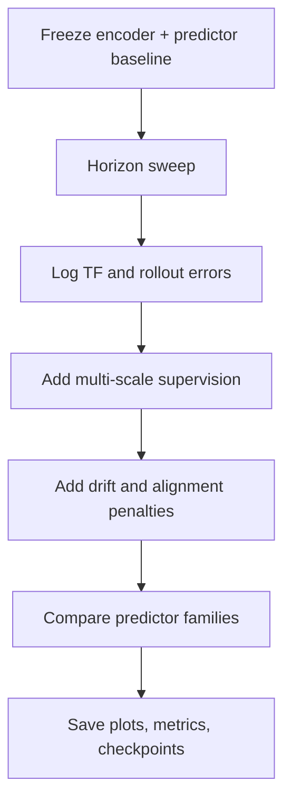

# Plan: Longer Rollout Horizons

## 1. Objective

Measure and improve latent rollout stability by increasing the prediction horizon `R` while keeping the encoder and predictor interface pluggable.

This plan is intentionally staged:

1. first, run horizon sweeps on the existing model to measure drift;
2. then, add multi-scale supervision over longer horizons;
3. then, add drift-aware terms if the sweep shows the need for them;
4. finally, compare predictor families under the same horizon contract.

## 2. Execution Order

Do not skip steps.

### Step 1: Lock the baseline

- Reuse the current encoder checkpoint.
- Reuse the current predictor checkpoint.
- Freeze the encoder for the main horizon-sweep study.
- Confirm that the latent cache format is unchanged.

### Step 2: Add horizon sweep evaluation

- Expose `R` as a first-class CLI argument.
- Evaluate horizons such as `R = 4, 8, 12, 16`.
- Keep the context length `C` fixed for the first sweep.
- Log teacher-forced and free-rollout metrics separately.

### Step 3: Add multi-scale supervision

- Add a configurable horizon set `\mathcal{H}`.
- Support both uniform and geometric horizon weights.
- Compare teacher-forced multi-scale loss against rollout-aware multi-scale loss.

### Step 4: Add drift-aware regularization

- Track `\mathbf{d}_r`, alignment cosine, and the local amplification proxy.
- Optionally penalize drift directly.
- Keep the drift term off by default until the diagnostic sweep is stable.

### Step 5: Compare predictor families

- Compare the current predictor against alternatives such as:
  - causal transformer,
  - Mamba,
  - cross-attention predictor,
  - lightweight temporal MLP or TCN baseline.

### Step 6: Save artifacts

- save checkpoints per epoch,
- save per-horizon plots,
- save metrics and rollout validation JSON,
- save a readable results report in the feature folder,
- save profiling output if profiling is enabled.

## 3. Implementation Shape

The core interface should remain:

```text
encoder(video) -> latents
predictor(context_latents) -> future_latents
```

The horizon sweep should not require a new encoder contract.
It should only change how many future steps are requested and how the losses are aggregated.

## 4. Planned Loss Menu

The implementation must support the following configurable loss families:

$$
\mathcal{L}_{\mathrm{mse}} = \ell_{\mathrm{mse}},
\qquad
\mathcal{L}_{\mathrm{norm}} = \ell_{\mathrm{norm}},
\qquad
\mathcal{L}_{\cos} = \ell_{\cos}.
$$

Balanced direct loss:

$$
\mathcal{L}_{\mathrm{balanced}}
=
\ell_{\mathrm{norm}} + 0.1\,\ell_{\mathrm{mse}} + 0.1\,\ell_{\cos}.
$$

Multi-scale loss:

$$
\mathcal{L}_{\mathrm{multi}}
=
\sum_{r \in \mathcal{H}} \lambda_r \, \ell(\hat{\mathbf{z}}_{t+r}, \mathbf{z}_{t+r}).
$$

Drift penalty:

$$
\mathcal{L}_{\mathrm{drift}}
=
\sum_{r \in \mathcal{H}} \|\mathbf{d}_r\|_2^2.
$$

Alignment penalty:

$$
\mathcal{L}_{\mathrm{align}}
=
\sum_{r \in \mathcal{H}} \left(1 - \cos\angle(\boldsymbol{\varepsilon}_r^{\mathrm{TF}}, \mathbf{d}_r)\right).
$$

The overall objective should remain a weighted combination of the active terms:

$$
\mathcal{L}
=
\alpha \mathcal{L}_{\mathrm{multi}}
+\beta \mathcal{L}_{\mathrm{drift}}
+\delta \mathcal{L}_{\mathrm{align}}.
$$

## 5. Rollout Metrics to Log

For each horizon `r`, log:

- teacher-forced MSE,
- rollout MSE,
- drift norm,
- alignment cosine,
- normalized error,
- local amplification ratio,
- decomposition residual.

Use the exact identities:

$$
\boldsymbol{\varepsilon}_r^{\mathrm{RO}} = \boldsymbol{\varepsilon}_r^{\mathrm{TF}} + \mathbf{d}_r
$$

and

$$
\|\boldsymbol{\varepsilon}_r^{\mathrm{RO}}\|_2^2
=
\|\boldsymbol{\varepsilon}_r^{\mathrm{TF}}\|_2^2
+\|\mathbf{d}_r\|_2^2
+2\langle \boldsymbol{\varepsilon}_r^{\mathrm{TF}}, \mathbf{d}_r \rangle
$$

as validation checks.

## 6. Validation Gate

Do not merge until all of the following are true:

- horizon sweeps run end-to-end,
- the run reports per-horizon diagnostics,
- multi-scale loss can be toggled,
- drift and alignment are logged,
- the new objective can be explained from the saved artifacts alone,
- the results show where the model begins to fail as `r` increases.

## 7. Mermaid View



