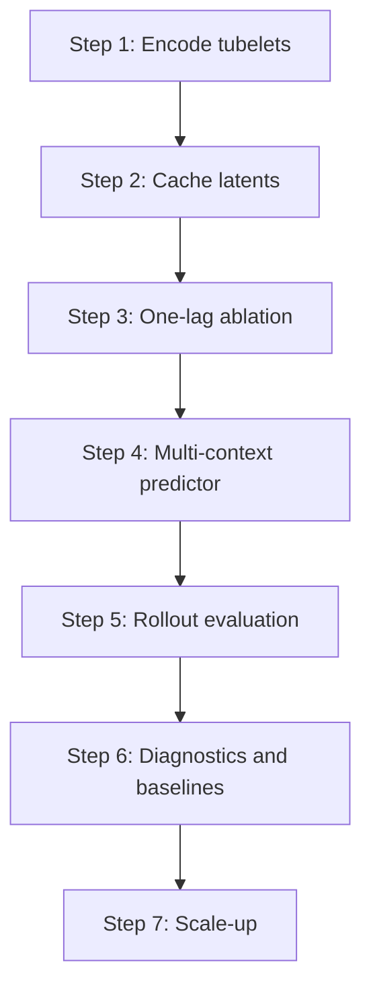

# Latent Video Dynamics Implementation Plan

## 1. Goal

Implement a latent video world-model pipeline that:

1. encodes video tubelets into latent vectors,
2. predicts future latent vectors with a temporal model,
3. evaluates teacher-forced and rollout behavior,
4. analyzes rollout error geometry and spectral structure,
5. saves plots and reports automatically with every training run.

This plan is intentionally execution-oriented.
The repo should be usable without manual notebook work or ad hoc postprocessing.

## 2. Canonical Repository Shape

The repository should have one clear source of truth for this project:

- spec: `docs/specs/video/latent_dynamics_pipeline_spec.md`
- plan: `docs/specs/video/latent_dynamics_pipeline_plan.md`
- training entrypoint: `scripts/run_video_world_model.py`
- validation entrypoint: `scripts/video/run_video_world_model_validation.py`
- training implementation: `src/jepa_world_models/analysis/video_world_model.py`
- rollout analysis: `src/jepa_world_models/analysis/video_world_model_validation.py`
- reporting and plots: `src/jepa_world_models/analysis/video_world_model_reporting.py`

The old video planning files should remain removed so there is no ambiguity about the active approach.

## 3. Execution Order

Follow this order when implementing the repo.
Do not start a later phase until the earlier phase works.

### Step 1: Encode tubelets

Implement the encoder interface and verify stable latent output.

### Step 2: Build the latent cache

Persist encoded latents with provenance metadata and reusable cache artifacts.

### Step 3: Run the one-lag ablation

Test the single-previous-latent autoregressive path before adding more context.

### Step 4: Add the multi-context predictor

Move from one-lag prediction to a context-window temporal model.

### Step 5: Evaluate rollouts

Compare teacher-forced and free-rollout forecasts and measure drift by horizon.

### Step 6: Add diagnostics and baselines

Log error decomposition, baseline comparisons, and spectral or gradient probes.

### Step 7: Scale up

Only after the earlier steps are stable should the run size and model capacity grow.



## 4. Interface and Cache Contract

The implementation must keep the encoder and predictor model-agnostic.
The code should be built around stable interfaces rather than a single backbone.

### 4.1 Encoder Interface

The encoder must accept a video clip and return a latent trajectory.

Required logical contract:

```text
Encoder(video_clip) -> latent_sequence
```

Concrete tensor contract:

```text
video_clip in R^{B x T x C x H x W}
latent_sequence in R^{B x N x D}
```

The implementation should support:

- batched inference,
- fixed or configurable clip lengths,
- deterministic evaluation mode,
- latent caching for repeated runs,
- stable latent dimensionality for a given encoder checkpoint.

### 4.2 Temporal Predictor Interface

The predictor consumes latent context and returns future latent predictions.

Required logical contract:

```text
Predictor(context_latents) -> future_latents
```

Concrete tensor contract:

```text
context_latents in R^{B x C x D}
future_latents in R^{B x H x D}
```

The implementation should support any causal temporal model family that satisfies the contract.

### 4.3 Latent Cache Format

The cache is the bridge between encoding and temporal training.
It must be explicit enough that a later run can verify the provenance of the cached latents.

Required cache contents:

- encoder identity or checkpoint fingerprint,
- optional encoder name,
- dataset split,
- source video identifiers,
- preprocessing settings,
- frame sampling settings,
- context length,
- forecast horizon,
- image size,
- latent tensors,
- cache format version,
- content hash or other provenance hash.

Recommended on-disk shape for each run:

```text
<cache-dir>/
  latent_sequence_bank_<fingerprint>.pt
  latent_sequence_bank_<fingerprint>.json
```

Recommended manifest fields:

- `cache_format_version`
- `cache_kind` = `latent_sequence_bank`
- `encoder_fingerprint`
- `encoder_name` if known
- `checkpoint_path`
- `data_root`
- `source_split`
- `subset_size`
- `image_size`
- `sample_fps`
- `total_frames`
- `context_frames`
- `future_frames`
- `latent_dim`
- `num_samples`
- `video_ids`
- `sample_indices`
- `created_at`
- `content_hash`

Recommended tensor payload fields:

- `context_latents` with shape `(N, C, D)`
- `future_latents` with shape `(N, H, D)`
- `sample_indices`
- `video_ids`
- `source_split`
- `checkpoint_path`
- `data_root`
- `subset_size`
- `image_size`
- `total_frames`
- `context_frames`
- `future_frames`
- `cache_format_version`
- `encoder_fingerprint`

If the cache is rewritten, the version and fingerprint must change.

## 5. Implementation Phases

### Phase 0: Clean Baseline

Objective:

- ensure the repo has one active latent-dynamics spec,
- ensure stale video planning docs are removed,
- ensure scripts and docs point at the canonical run artifacts.

Acceptance criteria:

- no remaining dependency on the old video planning docs,
- clear path from spec to script to outputs,
- canonical artifacts are documented in one place.

### Phase 1: Latent Tubelet Encoding

Objective:

- convert videos into tubelet sequences,
- encode tubelets into latent vectors `z_t`,
- cache latent sequences so repeated runs do not recompute everything.

Acceptance criteria:

- a clip can be loaded and converted into latent vectors,
- latent shape is stable and documented,
- the encoding stage is independently runnable and reproducible.

### Phase 2: Temporal Prediction

Objective:

- train a temporal model over latent sequences,
- predict one-step and multi-step futures,
- support configurable context length, future length, and sample rate.

Acceptance criteria:

- the model produces future latent predictions,
- training loss decreases on a sanity subset,
- step-level and epoch-level metrics are recorded.

### Phase 3: Rollout Evaluation

Objective:

- compare teacher-forced and free-rollout forecasts,
- measure error growth by horizon,
- log rollout geometry and local sensitivity.

Acceptance criteria:

- rollout validation is automatically generated,
- horizon-wise plots are saved,
- decomposition identities are numerically checked.

### Phase 4: Diagnostics

Objective:

- record per-loss components,
- compare against trivial baselines,
- inspect gradient norms and spectral proxies,
- test the one-lag autoregressive ablation,
- make it obvious why the model is failing or improving.

Acceptance criteria:

- plots clearly show the contribution of each objective term,
- metrics compare the model with `repeat_last` and `mean_context`,
- the one-lag ablation is available as a named control run,
- validation reveals whether rollout drift is geometric, spectral, or optimization-driven.

### Phase 5: Baseline Protocol

Baselines are mandatory and should be evaluated in every run.

Required baselines:

- `repeat_last`
  - copy the last context latent into each future step
- `mean_context`
  - copy the mean of the context latents into each future step

They must be computed on the same latent sequences, horizon, and split as the learned model.
They belong in `metrics.json`, `metric_comparison.png`, and the run summary.

If the learned model does not beat these baselines, the run is not a successful latent-dynamics model, even if the training loss decreases.

### Phase 6: Scale-Up

Objective:

- move from sanity runs to larger subsets and eventually full-scale data,
- retrain stronger temporal models,
- stress test the latent dynamics with more motion diversity.

Acceptance criteria:

- the same pipeline runs on larger subsets without changing the analysis interface,
- the plots and reports remain produced automatically,
- the results are interpretable at scale.

## 6. Standard Run Contract

The canonical training command should look like this:

```powershell
uv run python scripts/run_video_world_model.py `
  --checkpoint logs/videomae_large/best_videomae.pt `
  --data-root data `
  --source-split train `
  --subset-size 2000 `
  --context-seconds 4.0 `
  --future-seconds 2.0 `
  --sample-fps 4.0 `
  --feature-batch-size 1 `
  --batch-size 8 `
  --epochs 10 `
  --output-dir logs/video_world_model_medium `
  --cache-dir logs/video_world_model/cache `
  --profile
```

This command should:

- train the latent temporal model,
- write predictions,
- write metrics,
- run rollout validation,
- generate plots,
- optionally emit profiler traces.

## 7. Output Layout

Every run should write a self-contained directory:

```text
<output-dir>/
  result.json
  metrics.json
  predictions.csv
  rollout_validation.json
  plots/
    training_steps.png
    training_history.png
    training_components.png
    metric_comparison.png
    rollout_validation.png
    rollout_spectrum.png
  profile/
    video_world_model_trace.json
    profile_summary.json
```

All plots must be saved under `<output-dir>/plots/`.
The output directory must be readable without opening code.
The goal is for a run directory to explain itself.
## 8. Training Script Responsibilities

`scripts/run_video_world_model.py` is the main entrypoint.
It should:

1. parse the run configuration,
2. load the checkpointed video encoder,
3. build or reuse the latent cache,
4. train the temporal predictor,
5. save final metrics and predictions,
6. generate plots,
7. run rollout validation,
8. write profiler artifacts when requested.

If a flag disables plotting or validation, that should be explicit and opt-in.
The default behavior should favor diagnostic completeness.

## 9. Validation Script Responsibilities

`scripts/video/run_video_world_model_validation.py` should be the standalone way to inspect a trained checkpoint.

It should:

- load a run or checkpoint,
- compute rollout decomposition,
- validate the identities in the spec,
- emit a validation JSON report,
- generate the rollout plot.

This script is useful when the user wants to audit a checkpoint without retraining.

## 10. Plot Responsibilities

The report plots should answer specific questions.

### 8.1 Training Steps Plot

Show:

- step loss,
- optionally sub-losses,
- short-horizon optimization behavior.

Question answered:

- is the optimizer moving in the right direction at batch scale?

### 8.2 Training History Plot

Show:

- train loss per epoch,
- validation loss per epoch,
- optionally test loss.

Question answered:

- is training stable and does generalization improve?

### 8.3 Training Components Plot

Show:

- MSE loss,
- normalized MSE loss,
- cosine loss,
- combined weighted loss.

Question answered:

- which term is driving the objective?

### 8.4 Metric Comparison Plot

Show:

- model metrics,
- repeat-last baseline,
- mean-context baseline.

Question answered:

- is the learned predictor actually better than trivial dynamics?

### 8.5 Rollout Validation Plot

Show:

- teacher-forced error by horizon,
- rollout error by horizon,
- alignment term,
- local sensitivity,
- gradient contribution by horizon.

Question answered:

- why does error grow as horizon increases?

## 11. Detailed Work Items

### Work Item 1: Keep the repo clean

Tasks:

- remove outdated video planning docs,
- keep only the spec and implementation plan as canonical docs,
- avoid duplicating the same concept in multiple files.

### Work Item 2: Keep the outputs standardized

Tasks:

- ensure output file names do not change across runs,
- keep plots in `<output-dir>/plots/`,
- keep profiler data in `<output-dir>/profile/`,
- keep metrics in JSON, not only in stdout.

### Work Item 3: Keep the analysis reproducible

Tasks:

- store enough metadata to reproduce a run,
- include the latent and horizon settings in the run report,
- make the plots readable without cross-referencing code.

### Work Item 4: Make diagnostics first-class

Tasks:

- capture all loss components,
- capture rollout validation,
- capture baseline comparisons,
- capture horizon-wise summaries,
- capture step-level training traces.

### Work Item 5: Scale only after proof

Tasks:

- validate the math on small subsets,
- then run medium-scale experiments,
- then expand to larger data once the diagnostics are trustworthy.

## 12. Acceptance Criteria

The plan is complete when:

1. the repo has one clear latent-dynamics spec,
2. the plan maps directly to executable scripts,
3. training automatically writes metrics, plots, and rollout validation,
4. the outputs are standardized and documented,
5. old video planning docs are gone,
6. larger-scale latent dynamics experiments can be run without restructuring the repo.

## 13. Practical Definition of Done

For a given run, the user should be able to answer all of the following from saved artifacts alone:

- What data and checkpoint were used?
- What context and forecast horizon were trained?
- Did the model converge?
- Which loss term dominated?
- How does performance compare to trivial baselines?
- How does rollout error grow?
- Are there signs of directional drift or unstable horizons?

If the answer to these questions is not visible from the run directory, the pipeline is not yet complete.


