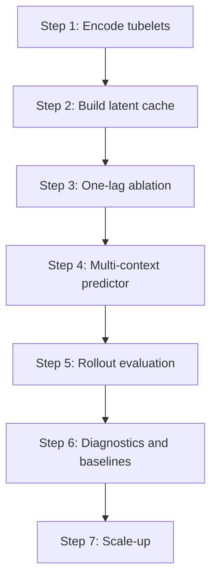

# Latent Video Dynamics Spec

## 1. Purpose

This repository is a latent video dynamics lab.
The central objective is not pixel-level reconstruction, but the study and improvement of future latent-state prediction for video.

We want to:

1. Encode video into tubelet-level latent vectors.
2. Learn a temporal model that predicts future latent vectors.
3. Compare teacher-forced predictions with free rollouts.
4. Measure rollout error growth as horizon increases.
5. Analyze rollout failure using geometry, alignment, gradients, and spectral structure.
6. Use those diagnostics to improve the model, not just its aggregate loss.

The intended output is a system that can explain:

- what the model predicts,
- how prediction degrades over horizon,
- which directions in latent space are stable or unstable,
- and how the temporal model behaves under rollout.

## 2. Non-Goals

This spec does not treat the following as the primary target:

- pixel-perfect video synthesis,
- single-frame reconstruction quality as the main metric,
- generic classification performance,
- purely aesthetic visualization without diagnostic value,
- unstructured hyperparameter searching without analysis.

Pixel generation may exist as a downstream step, but only after latent prediction and rollout analysis are working.

## 3. Problem Statement

Let a video clip be decomposed into a sequence of tubelets.
Each tubelet is encoded into a latent vector:

```text
z_1, z_2, ..., z_T
```

The learning problem is to estimate a temporal predictor:

```text
hat{z}_{t+r} = f_theta(z_{1:t})
```

or, in practical rollout form:

```text
hat{z}_{t+1} = f_theta(z_{1:t})
hat{z}_{t+2} = f_theta(z_{1:t}, hat{z}_{t+1})
...
```

The central question is not just whether a loss decreases.
The central question is whether the predicted latent trajectory remains close to the true future latent trajectory under rollout.

## 4. Implementation Sequence

The implementation should follow this order.
Do not skip ahead before the earlier step is working.

### Step 1: Tubelet Encoding

Implement the encoder interface and verify that a video clip can be converted into a stable latent trajectory.

### Step 2: Latent Cache

Persist the latent trajectory in the cache format defined in this spec.
The cache must include provenance and shape metadata.

### Step 3: One-Lag Ablation

Run the single-previous-latent autoregressive ablation first.
This isolates the effect of memory depth and recursive self-feeding.

### Step 4: Multi-Context Temporal Prediction

Extend from the one-lag case to a context-window predictor.
This is where the temporal model begins to use multiple latent states.

### Step 5: Rollout Evaluation

Compare teacher-forced and free-rollout predictions and measure horizon-wise drift.

### Step 6: Diagnostics and Baselines

Add error decomposition, baseline comparisons, gradient norms, and spectral analysis.

### Step 7: Scale-Up

Only after the above are stable should the pipeline move to larger subsets and stronger models.



## 5. System Overview

The pipeline has four stages.

### 5.1 Tubelet Encoding

Video is split into spatiotemporal tubelets.
Each tubelet is mapped into a latent embedding `z_t`.

This encoder is the representation front-end.
It should produce a compact, structured latent trajectory over time.

### 5.2 Temporal Forecasting

A temporal model consumes a context window of latent vectors and predicts one or more future latents.

The model may be autoregressive or multi-horizon.
The important requirement is that it supports rollout beyond a single step.

### 5.3 Rollout Evaluation

The model is evaluated in two regimes:

- teacher forcing, where ground-truth context is always available,
- free rollout, where model predictions are fed back into the predictor.

These regimes let us separate one-step fit from compounding error.

### 5.4 Error Analysis

We analyze why rollout fails or succeeds.
This includes:

- error decomposition,
- cosine alignment,
- per-horizon gradient contribution,
- empirical local sensitivity,
- spectral or SVD-style behavior of latent transition dynamics.

## 6. Interface Contract

The system must be model-agnostic.
The repository should only require stable interfaces, not one specific backbone.

### 6.1 Encoder Interface

The encoder consumes a video clip and returns a latent trajectory over tubelets.

Required logical contract:

```text
Encoder(video_clip) -> latent_sequence
```

More concretely:

```text
video_clip in R^{B x T x C x H x W}
latent_sequence in R^{B x N x D}
```

where:

- `B` is batch size,
- `T` is the number of sampled frames,
- `C` is the number of channels,
- `H, W` are spatial dimensions,
- `N` is the number of tubelet positions or latent steps,
- `D` is the latent dimension.

The encoder may be any reasonable feature extractor, including but not limited to convolutional, transformer-based, or hybrid video backbones.

The encoder contract must support the following properties:

- deterministic inference in evaluation mode,
- configurable input resolution,
- configurable clip length or tubelet span,
- stable latent dimensionality for a fixed checkpoint,
- batched execution,
- optional caching of the encoded latents.

### 6.2 Temporal Predictor Interface

The temporal predictor consumes latent context and produces future latent predictions.

Required logical contract:

```text
Predictor(context_latents) -> future_latents
```

More concretely:

```text
context_latents in R^{B x C x D}
future_latents in R^{B x H x D}
```

where:

- `C` is the context length in latent steps,
- `H` is the forecast horizon in latent steps,
- `D` is the latent dimension.

The predictor may be any causal temporal model, including but not limited to:

- causal transformers,
- recurrent models,
- state-space models,
- MLP-based window predictors,
- autoregressive rollout models.

The predictor contract must support:

- teacher-forced evaluation,
- free rollout evaluation,
- horizon-wise prediction logging,
- batch execution.

### 6.3 Latent Cache Interface

Latent encoding must be cacheable.
The cache is an intermediate artifact that decouples encoder execution from temporal training.

Required logical contract:

```text
Cache(video_clip_id, split, settings) -> latent_sequence_bank
```

A latent cache entry must be sufficient to answer all of the following later:

- Which encoder produced these latents?
- Which dataset split and source videos were used?
- Which sampling and preprocessing settings were applied?
- Which context and horizon settings were assumed?
- Which exact latent tensors were cached?

Recommended on-disk cache layout:

```text
<cache-dir>/
  latent_sequence_bank_<fingerprint>.pt
  latent_sequence_bank_<fingerprint>.json
```

Recommended manifest fields:

- `cache_format_version`
- `cache_kind` = `latent_sequence_bank`
- `encoder_fingerprint`
- `encoder_name` if known
- `checkpoint_path` or equivalent source reference
- `data_root`
- `source_split`
- `subset_size`
- `image_size`
- `sample_fps`
- `total_frames`
- `context_frames`
- `future_frames`
- `latent_dim`
- `num_samples`
- `video_ids`
- `sample_indices`
- `created_at`
- `content_hash` or equivalent provenance hash

Recommended tensor payload fields:

- `context_latents` with shape `(N, C, D)`
- `future_latents` with shape `(N, H, D)`
- `sample_indices`
- `video_ids`
- `source_split`
- `checkpoint_path`
- `data_root`
- `subset_size`
- `image_size`
- `total_frames`
- `context_frames`
- `future_frames`
- `cache_format_version`
- `encoder_fingerprint`

If the cache is rewritten, the version and fingerprint must change.

## 7. Mathematical Definition

### 7.1 Latent Sequence

For a video clip, let the encoder produce latent states:

```text
Z = {z_1, z_2, ..., z_T},  z_t in R^d
```

where `d` is the latent dimension.

If the encoder is tubelet-based, each `z_t` corresponds to a tubelet interval rather than a single pixel frame.

### 7.2 Forecasting Objective

Let the context length be `C` and the forecast horizon be `H`.
The model predicts future latents:

```text
hat{z}_{C+1}, hat{z}_{C+2}, ..., hat{z}_{C+H}
```

Given the ground truth future latents:

```text
z_{C+1}, z_{C+2}, ..., z_{C+H}
```

define the per-horizon residual:

```text
e_r = z_{C+r} - hat{z}_{C+r}
```

for `r = 1..H`.

### 7.3 Loss Terms

The training objective is a weighted combination of latent prediction terms.

Typical components:

```text
L_mse = (1/H) sum_r ||z_{C+r} - hat{z}_{C+r}||_2^2
```

Normalized MSE:

```text
L_norm = (1/H) sum_r ||normalize(z_{C+r}) - normalize(hat{z}_{C+r})||_2^2
```

Cosine loss:

```text
L_cos = (1/H) sum_r (1 - cos(z_{C+r}, hat{z}_{C+r}))
```

where

```text
cos(a, b) = <a, b> / (||a||_2 ||b||_2 + eps)
```

The combined objective is:

```text
L_total = lambda_mse * L_mse + lambda_norm * L_norm + lambda_cos * L_cos
```

The weights should be exposed in config and logged explicitly.

### 6.4 Single-Lag Autoregressive Ablation

Before testing longer context windows, the pipeline must support a one-previous-latent ablation.

Required recurrence:

```text
hat{z}_{t+1} = g_theta(z_t)
hat{z}_{t+r+1} = g_theta(hat{z}_{t+r})
```

This mode uses only the immediately previous latent as input.
It is intended to isolate the effect of memory depth and to test whether a single-lag dynamical rule already captures useful structure.

This ablation should be evaluated with the same latent cache, the same evaluation split, and the same horizon reporting as the multi-context model.

Questions this ablation should answer:

- How much predictive power comes from the last latent alone?
- Does recursive self-feeding collapse quickly or remain stable?
- Does adding more context materially improve rollout beyond one-lag prediction?
- Are the dominant error directions visible already in the one-lag setting?

## 6. Rollout Error Analysis

The spec requires horizon-wise diagnostics.

### 8.1 Teacher-Forced vs Rollout Prediction

For each horizon `r`, compute:

```text
hat{z}^{TF}_{C+r}
hat{z}^{RO}_{C+r}
```

where:

- `TF` is the teacher-forced prediction,
- `RO` is the free-rollout prediction.

Define:

```text
e_r^{TF} = z_{C+r} - hat{z}^{TF}_{C+r}
e_r^{RO} = z_{C+r} - hat{z}^{RO}_{C+r}
d_r = hat{z}^{TF}_{C+r} - hat{z}^{RO}_{C+r}
```

Then the identity:

```text
e_r^{RO} = e_r^{TF} + d_r
```

must hold numerically up to floating-point tolerance.

The norm identity:

```text
||e_r^{RO}||_2^2
= ||e_r^{TF}||_2^2 + ||d_r||_2^2 + 2 <e_r^{TF}, d_r>
```

must also be checked.

These are geometry checks, not model claims.

### 8.2 Alignment

The alignment term is:

```text
cos(theta_r) = <e_r^{TF}, d_r> / (||e_r^{TF}||_2 ||d_r||_2 + eps)
```

This tells us whether rollout drift aligns with existing prediction error or works against it.

Interpretation:

- positive alignment can amplify error,
- negative alignment can partially correct error,
- near-zero alignment suggests independent perturbation.

### 8.3 Empirical Local Sensitivity

For a local input perturbation ratio, define:

```text
R_r = ||F(u_r) - F(v_r)||_2 / (||u_r - v_r||_2 + eps)
```

where `u_r` and `v_r` are comparable inputs to the temporal model at the same horizon, such as teacher-forced versus rolled-out context.

This is not a proof of Lipschitz continuity.
It is a practical stability proxy on actual data.

### 8.4 Gradient Contribution by Horizon

If training uses a multi-horizon loss:

```text
L = sum_r eta_r L_r
```

then compute the gradient norm contributed by each horizon.

This helps diagnose whether long-horizon supervision is dying out.

### 8.5 Spectral / SVD-Style Analysis

We want to understand whether latent dynamics exhibit low-rank structure or unstable directions.

The analysis may include:

- singular values of latent transition matrices or approximations,
- Jacobian-vector or vector-Jacobian probes,
- directional amplification factors,
- horizon-wise spectral decay.

The key question is whether rollout errors are concentrated in a few dominant directions or spread across many modes.

## 9. Training Behavior Requirements

The training script must:

1. log step-level loss values,
2. log epoch-level aggregate metrics,
3. log each objective component separately,
4. store predictions,
5. generate plots automatically,
6. run rollout validation automatically unless explicitly disabled,
7. save outputs into a clean run directory.

This is not optional.
The point of the repository is to produce evidence, not just checkpoints.

## 10. Required Artifacts

Each run should write:

- `result.json`
- `metrics.json`
- `predictions.csv`
- `rollout_validation.json`
- `plots/training_steps.png`
- `plots/training_history.png`
- `plots/training_components.png`
- `plots/metric_comparison.png`
- `plots/rollout_validation.png`
- `plots/rollout_spectrum.png`
- optional profiler artifacts

All plots must be saved under `<output-dir>/plots/`.
The output directory should be the primary source of truth for a run.
## 11. Interpretation of Metrics

### 9.1 Latent MSE

Measures direct squared error in latent space.

Lower is better, but it is not sufficient alone.

### 9.2 Normalized Latent MSE

Measures error after normalizing latent vectors.

This reduces sensitivity to scale and highlights angular / directional mismatch.

### 9.3 Cosine Similarity

Measures alignment of predicted and true latent directions.

If cosine similarity is high but MSE is still poor, the model may be getting direction right but scale wrong.

If cosine similarity is low, the latent trajectory is geometrically misaligned.

### 9.4 Baseline Comparisons

The model must be compared to trivial baselines such as:

- repeat last latent,
- mean context latent.

If a learned model does not beat these baselines, the objective or architecture is not yet sufficient.

## 12. Baseline Protocol

Baselines are mandatory.
They are part of the scientific definition of the experiment, not a convenience feature.

### 10.1 Required Baselines

Every run must include, at minimum:

- `repeat_last`
  - predict each future latent by copying the last observed context latent
- `mean_context`
  - predict each future latent by using the mean of the context latents

These baselines should be computed on the same latent sequences, context length, forecast horizon, and split as the learned model.

### 10.2 Why These Baselines Exist

These baselines answer a simple question:

is the learned model doing something nontrivial, or is it merely smoothing or copying the context?

If the model cannot outperform `repeat_last`, it is not yet learning useful temporal structure.

If the model only matches `mean_context`, it may be collapsing to a low-variance solution rather than learning dynamics.

### 10.3 How Baselines Must Be Reported

Baseline results must be:

- written into `metrics.json`,
- shown in `metric_comparison.png`,
- compared on the same evaluation split as the learned model,
- reported for both latent MSE and normalized latent MSE,
- included in any rollout validation summary when applicable.

### 10.4 Interpretation Rule

If the learned model does not clearly beat the required baselines, the experiment should be treated as a failure of the current modeling setup, not as a successful world model.

## 13. Experimental Philosophy

The project should be built in layers:

1. verify the decomposition algebra,
2. verify the rollout validation numerically,
3. verify the training curves are stable,
4. compare against baselines,
5. add spectral and SVD-style diagnostics,
6. scale to larger data and stronger models.

This avoids starting with an overcomplicated setup before the math is trusted.

## 14. Datasets

The target domain is large-scale video.

Dataset requirements:

- enough motion diversity to stress temporal prediction,
- enough data to train nontrivial latent dynamics,
- enough variability to expose rollout failure modes.

The repo may use smaller subsets for sanity runs, but the final target is large-scale video training.

## 15. Implementation Constraints

Implementation should follow these rules:

- keep the latent encoder and temporal predictor modular,
- make horizon length configurable,
- make context length configurable,
- make sample rate configurable,
- keep profiling optional but integrated,
- keep plotting integrated,
- keep rollout validation integrated,
- keep old planning docs out of the main path once superseded.

## 16. Repository-Level Success Criteria

This work is successful if the repo can answer:

1. How well do latent rollouts track true future latent trajectories?
2. How does error grow with horizon?
3. Is failure caused by magnitude, direction, or sensitivity?
4. Do spectral or low-rank effects explain instability?
5. Can these diagnostics guide better temporal modeling?

If the repo can answer those questions clearly, it is serving the intended purpose.

## 17. Deliverable Summary

The repository should end up as:

- a latent tubelet encoder lab,
- a future latent forecasting benchmark,
- a rollout error analysis suite,
- and a diagnostics-driven path toward stronger world models.


