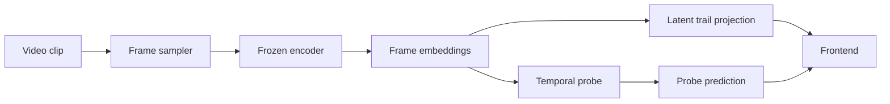

# Frontend Implementation Plan

## Goal

Build a clear, local-hosted frontend for the video probe.

The frontend should make the model behavior easy to inspect without turning into a flashy demo.

It should show:

1. the current video clip
2. the latent trail across frames
3. the forward vs reversed compare mode
4. the nearest neighbors for the chosen frame or clip

---

## What The Frontend Is For

This is not a dashboard full of charts.

It is a visual explanation layer for the probe.

The frontend should help answer:

- what does the clip look like?
- how does the latent embedding move over time?
- does reversing the clip change the embedding path?
- what are the nearest matching clips?

---

## Layout

Use a simple three-part layout:

1. top controls
2. main visualization area
3. supporting evidence section

### Top Controls

- clip selector
- play / pause
- step backward / forward by frame
- toggle compare forward vs reversed

### Main Visualization Area

- left: video player
- right: latent trail plot

### Supporting Evidence Section

- nearest neighbors
- selected clip metadata
- short note describing what to look at

---

## Compare Mode

Compare mode should show both:

- forward embedding trail
- reversed embedding trail

This should be visible in the same viewport as the current clip, not buried at the bottom of the page.

The point is to make the difference easy to see.

When compare mode is on:

- the compare button should look active
- the forward trail should be highlighted
- the reversed trail should be visually distinct
- the neighbor panel should move below the comparison area

---

## Latent Trail

The latent trail is a simple 2D visualization of how the frame embeddings move over time.

We should treat it as a trajectory, not a physics plot.

Use it to show:

- whether the embedding moves smoothly
- whether it turns sharply
- whether the forward and reversed paths differ

This is the visual part that makes the temporal probe understandable.

---

## Data Needed By The Frontend

The frontend should load:

- clip id
- frame list
- latent embeddings per frame
- probe prediction
- nearest neighbors
- forward and reversed paths

The frontend should not recompute training features.

It should read from saved artifacts.

---

## Training Artifact Flow

---

## Visual Rules

Keep it simple:

- plain typography
- clear section titles
- minimal chrome
- no metric wall

The frontend should feel like a research tool, not a product landing page.

---

## Files

Expected files:

- `frontend/video.html`
- `frontend/video.css`
- `frontend/video.js`

Supporting scripts:

- `scripts/serve_video_demo.py`
- `scripts/run_video_dynamics.py`
- `scripts/run_video_temporal_probe.py`

---

## What To Avoid

Do not:

- show too many scores at once
- bury compare mode below the fold
- overdecorate the page
- make the latent plot look like a random line chart

The point is clarity.

---

## Next Step

Once the probe artifacts are ready:

1. load a clip
2. show the forward trail
3. add compare mode
4. show nearest neighbors
5. show probe prediction

That is enough for the first useful version.
