# Latent Dynamics Experiment Report

This report summarizes the `swin + mamba` latent world-model run on the 50k Something-Something V2 train split, together with the rollout diagnostics used to study error propagation in latent space.

## Notation

The notation below is the one used in this report.

| Symbol | Meaning |
|---|---|
| $x_{t:t+T-1}$ | sampled video clip of `T` frames |
| $\tau$ | tubelet size in frames |
| $z_t \in \mathbb{R}^d$ | latent vector at latent step `t` |
| $Z_{a:b}$ | stacked latent window $[z_a, \ldots, z_b]$ |
| $C$ | number of context latent steps |
| $F$ | number of future latent steps |
| $\hat{z}$ | predicted latent |
| $\theta$ | temporal predictor parameters |

For this run:

| Quantity | Value |
|---|---|
| `T` | `24` |
| $\tau$ | `2` |
| `C` | `8` |
| `F` | `4` |
| `d` | `192` |

The frame-level temporal split is:

| Segment | Frames |
|---|---|
| context | `16` |
| future | `8` |

Because the encoder uses tubelets of size `2`, the latent sequence length is halved:

| Segment | Latent steps |
|---|---|
| context latents | `8` |
| future latents | `4` |

## Goal

The objective was:

1. Encode video tubelets into a latent sequence $z_1, z_2, \ldots$.
2. Predict future latent vectors from past latent context.
3. Analyze rollout error, drift, alignment, and singular-spectrum behavior.

This run used a frozen encoder and a trainable temporal predictor.

## Run Summary

| Item | Value |
|---|---:|
| Encoder | `swin` |
| Predictor | `mamba` |
| Encoder checkpoint | `logs/encoder_checkpoints/encoder_swin_pretrained.pt` |
| Train split size | `50,000` videos |
| Validation split size | `10,000` videos |
| Test split size | `5,000` videos |
| Training epochs | `10` |
| Best epoch | `8` |
| Predictor batch size | `128` |
| Feature batch size | `4` |
| DataLoader workers | `2` |
| Device | `cuda:0` |
| Image size | `224` |
| Context duration | `4.0 s` |
| Future duration | `2.0 s` |
| Sample rate | `4.0 fps` |
| Total frames per clip | `24` |
| Context frames | `16` |
| Future frames | `8` |
| Context latent steps | `8` |
| Future latent steps | `4` |
| Latent dim | `192` |
| Rollout validation samples | `500` |

## Command Used

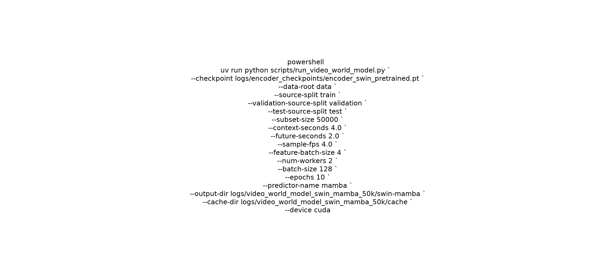

## Dataset and Temporal Geometry

The pipeline uses physical split folders:

- `data/data_videos/train`
- `data/data_videos/validation`
- `data/data_videos/test`

The training run sampled from the train split and built latent caches for:

- `50,000` train videos
- `10,000` validation videos
- `5,000` test videos

With `4 fps`, the temporal windows become:

- `4.0 s` context = `16` frames
- `2.0 s` future = `8` frames

The encoder uses tubelets of size `2`, so:

- `16` frames -> `8` latent context steps
- `8` frames -> `4` latent future steps

Thus the predictor sees

and predicts

with `C = 8`, `F = 4`, and `d = 192`.

## Model Details

### Encoder

- Frozen `swin` encoder
- Checkpoint: `logs/encoder_checkpoints/encoder_swin_pretrained.pt`
- Latent dimension: `192`
- Tubelet size: `2`

The encoder is used only to build the latent cache.

### Temporal Predictor

- `mamba` predictor
- Hidden width: `128`
- Layers: `2`
- Attention heads: `4`
- Dropout: `0.1`
- Context mode: `context`

The predictor is trained on cached latent windows rather than raw video.

Formally, the predictor implements

and produces

## Training Objective

For each minibatch, the trainer minimizes a combined latent-space objective:

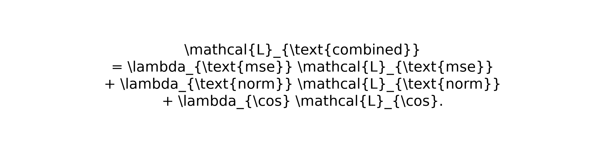

The components are:

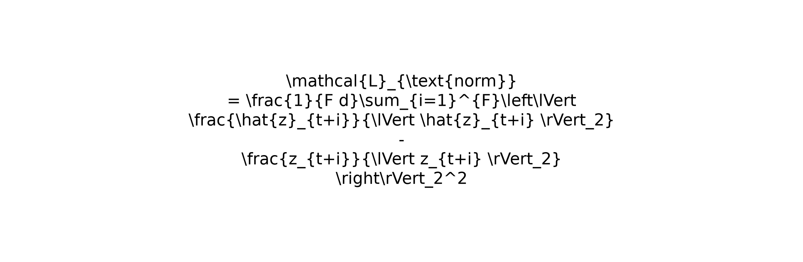

The logs report:

- `mse_loss`
- `normalized_mse_loss`
- `cosine_loss`
- `combined_loss`

The batch-level plots show how each term evolves during optimization.

## Training Behavior

The predictor loss decreased steadily over 10 epochs:

| Epoch | Train loss | Val loss |
|---|---:|---:|
| 1 | 0.008972 | 0.007671 |
| 2 | 0.007415 | 0.007358 |
| 3 | 0.007201 | 0.007254 |
| 4 | 0.007102 | 0.007186 |
| 5 | 0.007043 | 0.007161 |
| 6 | 0.007001 | 0.007146 |
| 7 | 0.006966 | 0.007128 |
| 8 | 0.006937 | 0.007123 |
| 9 | 0.006909 | 0.007132 |
| 10 | 0.006886 | 0.007126 |

Best validation epoch:

- `epoch 8`

Per-epoch checkpoints were written to:

- `logs/video_world_model_swin_mamba_50k/swin-mamba/checkpoints/`

The final predictor checkpoint is:

- `logs/video_world_model_swin_mamba_50k/swin-mamba/decoder_mamba.pt`

## Final Metrics

| Split | Latent MSE | Normalized Latent MSE | Cosine Similarity |
|---|---:|---:|---:|
| Train | 0.039164 | 0.002904 | 0.721224 |
| Val | 0.040889 | 0.003032 | 0.708965 |
| Test | 0.040772 | 0.003023 | 0.709807 |

Overall trainer losses:

- Train loss: `0.006937`
- Val loss: `0.007123`
- Test loss: `0.007100`

These are the combined loss values used during predictor optimization. The evaluation metrics above are computed directly in latent space over the full predicted window.

## Baseline Comparison

Two trivial baselines were evaluated on the same latent windows:

- `repeat_last`
- `mean_context`

### Test Split

| Model | Latent MSE | Normalized Latent MSE | Cosine Similarity |
|---|---:|---:|---:|
| `repeat_last` | 0.050216 | 0.003090 | 0.703342 |
| `mean_context` | 0.039955 | 0.002855 | 0.725948 |
| `swin + mamba` | 0.040772 | 0.003023 | 0.709807 |

Interpretation:

- The learned predictor improves over `repeat_last` on MSE.
- It does **not** beat `mean_context` on validation/test.
- This run is a functioning latent world-model pipeline, but not yet a strong predictor.

## Rollout Validation

The rollout report evaluates teacher-forced prediction versus free rollout in latent space.

At each rollout horizon `r`, the report compares:

- teacher-forced prediction `$\hat{z}^{\mathrm{TF}}_{t+r}$`
- rollout prediction `$\hat{z}^{\mathrm{RO}}_{t+r}$`
- target latent `$z_{t+r}$`

The key error vectors are:

These satisfy the exact identity

and therefore

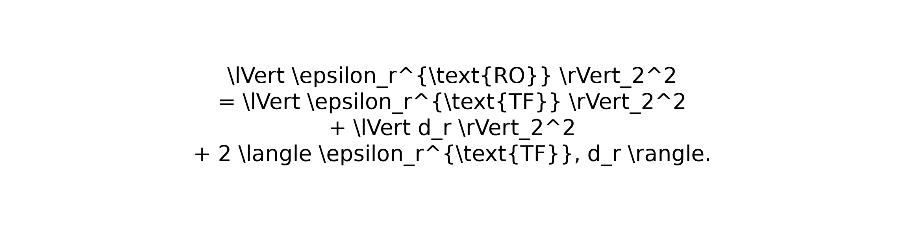

The validation script checks this numerically up to floating-point tolerance.

### Horizon Summary

| Horizon | Teacher-Forced MSE | Rollout MSE | Drift Norm | Alignment Cosine |
|---|---:|---:|---:|---:|
| 1 | 0.035822 | 0.035822 | 0.000000 | 0.000000 |
| 2 | 0.035739 | 0.047523 | 1.754896 | -0.074558 |
| 3 | 0.033659 | 0.054192 | 2.138515 | -0.042175 |
| 4 | 0.029417 | 0.060781 | 2.428106 | 0.014545 |

The alignment cosine is

when both norms are nonzero.

Interpretation:

- `$\cos \theta_r \approx 1$` means drift reinforces teacher-forced error
- `$\cos \theta_r \approx 0$` means roughly orthogonal drift
- `$\cos \theta_r < 0$` means drift partially cancels the teacher-forced error

### What This Means

- Rollout error compounds with horizon.
- The model does not self-correct strongly once it starts feeding on its own predictions.
- The latent drift has a measurable, structured geometry rather than looking like pure isotropic noise.

## Singular Spectrum

The rollout validation also computes a singular-spectrum proxy.

For each horizon, the report tracks the dominant singular value and total spectral energy of:

- teacher-forced error samples
- rollout error samples
- drift samples

### Singular Values and Energy

| Horizon | Teacher-Forced Top Singular Value | Rollout Top Singular Value | Drift Top Singular Value |
|---|---:|---:|---:|
| 1 | 16.0556 | 16.0556 | 0.0000 |
| 2 | 15.2938 | 18.6774 | 10.7586 |
| 3 | 14.1536 | 21.4195 | 14.8519 |
| 4 | 13.3649 | 24.2946 | 17.6320 |

Interpretation:

- Teacher-forced energy decays with horizon.
- Rollout energy grows with horizon.
- Drift energy grows as well, which is consistent with accumulating latent instability.

The trend is important:

for larger `r`, which means free rollout error becomes increasingly anisotropic.

## Gradient Norms

| Horizon | Loss | Gradient Norm |
|---|---:|---:|
| 1 | 0.028402 | 0.066255 |
| 2 | 0.025123 | 0.070554 |
| 3 | 0.021588 | 0.065878 |
| 4 | 0.016922 | 0.059552 |

Interpretation:

- Gradients are present at all horizons.
- There is no obvious catastrophic gradient collapse in this run.
- The main issue is forecast quality, not lack of train signal.

This suggests the model is not failing because supervision disappears. Instead, the forecast objective itself is not sufficient to keep the free rollout close to the latent manifold under repeated prediction.

## Artifacts

### Main Outputs

- Metrics: `logs/video_world_model_swin_mamba_50k/swin-mamba/metrics.json`
- Rollout validation: `logs/video_world_model_swin_mamba_50k/swin-mamba/rollout_validation.json`
- Predictor checkpoint: `logs/video_world_model_swin_mamba_50k/swin-mamba/decoder_mamba.pt`
- Predictions: `logs/video_world_model_swin_mamba_50k/swin-mamba/predictions.csv`
- Per-epoch checkpoints: `logs/video_world_model_swin_mamba_50k/swin-mamba/checkpoints/`

### Figures

The plots below are copied into the docs tree so they can be embedded directly in this report.

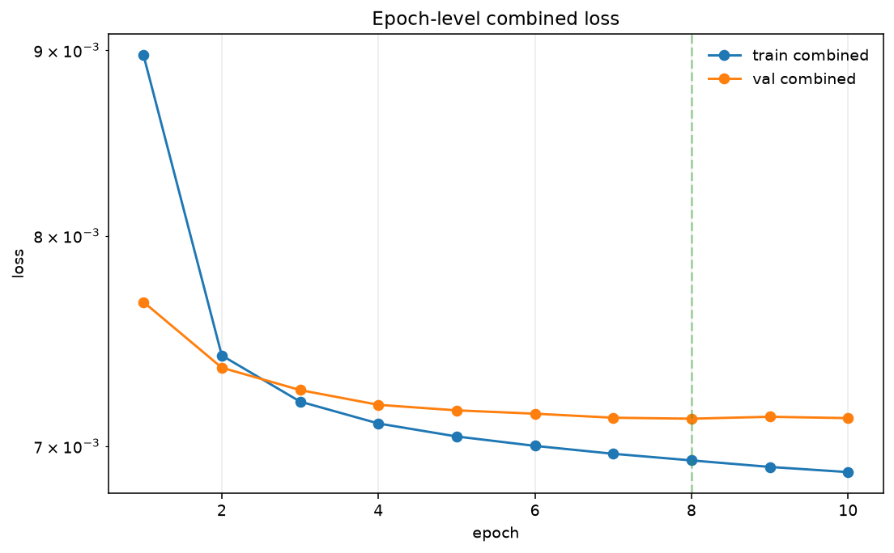

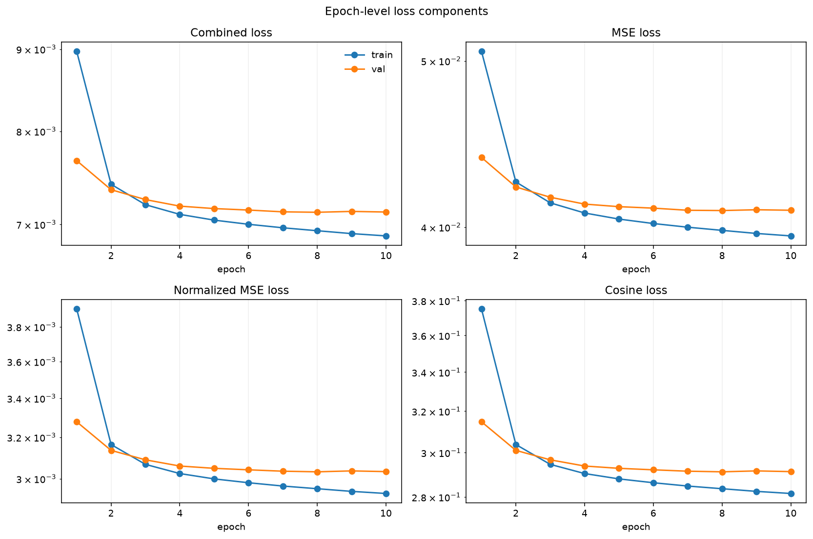

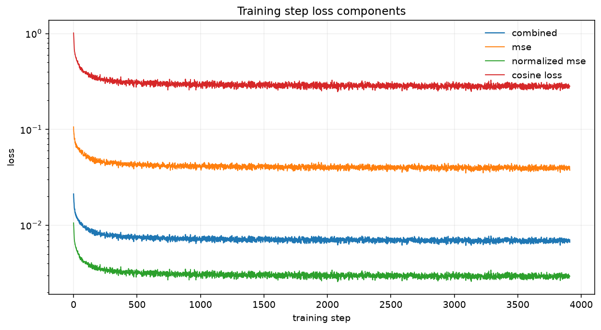

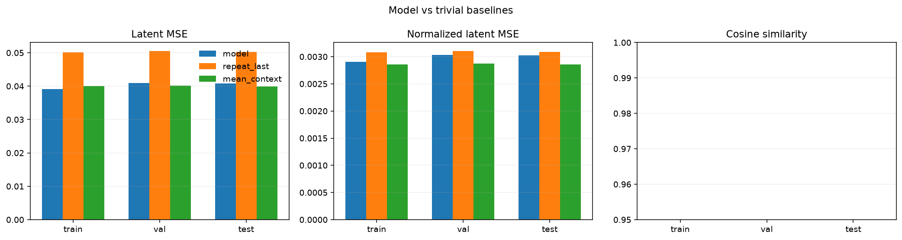

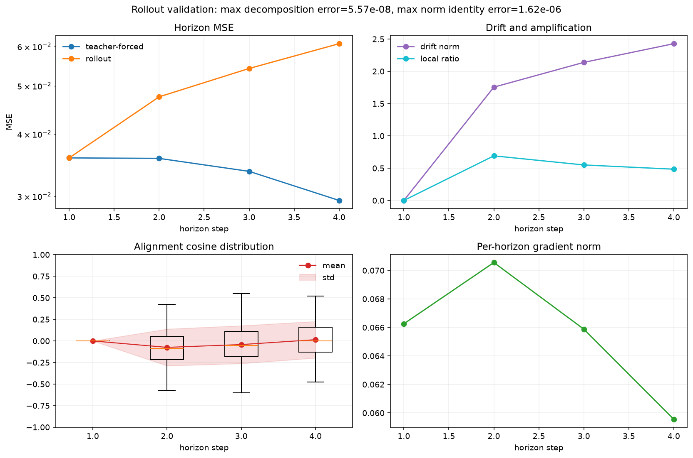

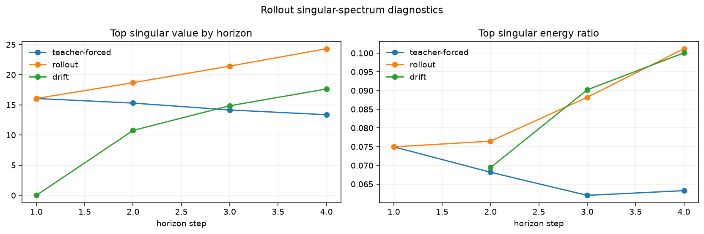

## Implementation Notes

The saved artifact layout is:

- `decoder_mamba.pt`: best predictor checkpoint
- `checkpoints/decoder_mamba_epoch_*.pt`: per-epoch snapshots
- `metrics.json`: training and test summary
- `rollout_validation.json`: rollout/alignment/spectrum diagnostics
- `predictions.csv`: per-sample latent prediction table

The encoder is frozen during predictor training, so the experiment isolates the temporal modeling problem:

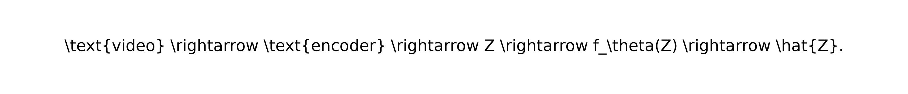

That separation is useful for iterative experiments because the encoder can be kept fixed while the predictor, context length, and rollout losses are swapped independently.

## Conclusion

This run validates the full latent-dynamics pipeline:

- video -> tubelets -> latent cache
- latent context -> temporal predictor
- teacher-forced evaluation
- free rollout evaluation
- drift/alignment/SVD-style analysis

But the current `swin + mamba` pair is not yet strong enough to beat the simple `mean_context` baseline on validation/test. The next experiments should focus on:

1. stronger temporal predictor families
2. different context lengths
3. alternative encoder / predictor pairings
4. horizon-aware rollout objectives and drift regularization

## Derivation Notes

This section spells out the geometry behind the rollout analysis in a compact form.

### Teacher-Forced Versus Rollout Prediction

Let the target latent at horizon `r` be `z_{t+r}`.

Teacher-forced prediction uses ground-truth context at each step:

Free rollout instead feeds previous predictions back into the context:

The distinction matters because the rollout context gradually departs from the data manifold.

### Error Decomposition

Define:

Then:

This is the exact decomposition used in the report.

The squared norm identity follows immediately:

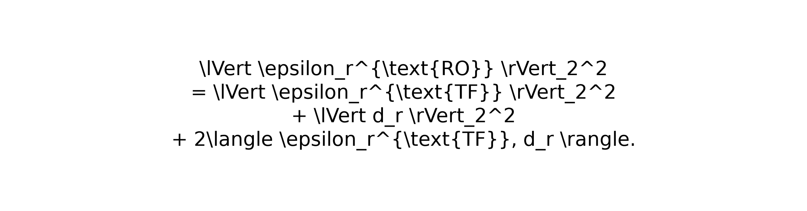

So rollout degradation is controlled by:

1. the teacher-forced error magnitude,
2. the drift magnitude,
3. their alignment.

### Alignment Term

The alignment coefficient is:

The sign is the key diagnostic:

- positive: drift amplifies teacher-forced error
- negative: drift partially compensates for teacher-forced error
- near zero: drift is roughly orthogonal

In this run the alignment was weak and often slightly negative, which means the free rollout drift does not cleanly correct the teacher-forced residual.

### A Useful Lipschitz-Style Proxy

Let `$u_r$` and `$v_r$` denote the teacher-forced and rollout contexts at horizon `r`. A local amplification proxy is:

If `$\rho_r$` grows with horizon, the temporal model is increasingly sensitive to context mismatch. That is consistent with the observed rise in rollout error and drift energy.

### Why Mean-Context Is Hard to Beat

The `mean_context` baseline is strong because latent video trajectories in this setting are smooth enough that a simple low-variance estimate is already competitive.

If the model predicts

that is not sufficiently better than the latent average of the context, then the learned temporal map is not extracting enough motion-specific signal from the context window.

That is exactly what happened here:

- better than `repeat_last`
- not better than `mean_context`

So the model learned something, but not enough temporal structure.

## Plot Interpretation

### Training Steps

This plot shows the minibatch-level loss values inside epoch training.

What to look for:

- early high variance is normal
- later stability means optimization is not diverging
- the downward trend here shows the predictor is fitting the cached latents

### Training History

This plot summarizes epoch-level train and validation loss.

What it shows here:

- both curves descend steadily
- the validation curve flattens around epoch 8
- no obvious late-epoch blowup

That is why the best checkpoint is epoch 8 rather than epoch 10.

### Training Components

This plot separates the contributions of:

- MSE
- normalized MSE
- cosine loss
- combined loss

It matters because a model can reduce one component while still worsening another. In this run the components move together, which suggests the optimization is internally coherent even if the final predictor is still weak against the baseline.

### Metric Comparison

This plot compares the final train/val/test metrics against the trivial baselines.

The key takeaway is:

- the learned predictor beats `repeat_last`
- the learned predictor does not beat `mean_context`

So the model is clearly learning something beyond a degenerate copy rule, but it is still not strong enough to outperform the mean-context baseline.

### Rollout Validation

This is the most important plot for the theory document.

It shows:

- teacher-forced error
- rollout error
- drift norm
- alignment statistics

The visual pattern is the same as the table:

- horizon 1 is trivial
- later horizons diverge
- drift accumulates
- alignment is weak

### Rollout Spectrum

This plot shows how the dominant singular direction of the residuals grows with horizon.

Interpretation:

- rollout residuals become increasingly structured
- the leading direction dominates more at longer horizons
- this is consistent with systematic instability rather than pure noise

## Practical Takeaway

The experiment answer is not "the model failed."

The more accurate statement is:

is a valid pipeline, but the current choice of temporal predictor and context length is not enough to beat a strong low-variance latent baseline.

That gives us a clear next step:

1. keep the encoder frozen
2. sweep context length
3. compare stronger predictors
4. add horizon-aware rollout training
5. track the same decomposition and SVD diagnostics again
