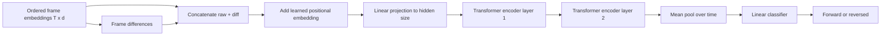

# Temporal Improvement Plan

## Goal

Replace the current flat temporal probe with a small transformer encoder that reads ordered frame embeddings.

This keeps the frozen VICReg encoder unchanged.
Only the temporal head changes.

---

## Why Use A Transformer

The current probe needs to understand order and longer-range relations between frames.

A small transformer is a better fit because it:

- compares any frame to any other frame
- uses positional information explicitly
- can model longer-range temporal relationships
- is still small enough to explain and train on this project

---

## Scope

Only implement the transformer temporal probe.

Do not change:

- the frozen VICReg encoder
- the dataset source
- the 32-frame sampling rule
- the automatic 70/20/10 split
- the cache mechanism

Do not add:

- GRUs
- larger sequence models
- VideoMAE
- full video pretraining

---

## Input Shapes

For one clip:

- frames: `(T, 3, 96, 96)`
- encoder output: `(T, d)`
- `T = 32`

For a batch:

- features: `(B, T, d)`

The transformer operates over the time axis.

---

## Proposed Architecture

The transformer head should be:

1. build an augmented per-frame feature:
   - raw frame embedding
   - frame-to-frame difference
2. add a learned positional embedding
3. project the feature to a hidden size
4. run a small transformer encoder
5. average pool over time
6. apply a final linear classifier to 2 logits

Suggested default architecture:

- input dimension: `2d`
- hidden size: `128`
- attention heads: `4`
- encoder layers: `2`
- activation: `gelu`
- pooling: mean over time

---

## Architecture Diagram

---

## Saved Artifacts

Use checkpoint names that make the model type obvious:

- `best_temporal_transformer.pt`
- `temporal_transformer.pt`

Keep the report files in the same output directory.

---

## Training Behavior

The pipeline stays the same:

1. load the frozen VICReg checkpoint
2. sample 32 frames per clip
3. encode frames once
4. reuse cached source embeddings when available
5. train the transformer probe on GPU
6. save the best checkpoint
7. write train / validation / test metrics

---

## What This Should Improve

Compared to the 1D conv probe, the transformer should:

- compare distant frames more directly
- use order information more flexibly
- have a better chance of finding temporal cues in the frozen representation

If it still fails, that is a useful signal too:

- the frozen encoder may not contain a strong order signal
- or the task may need a video-specific backbone

---

## Evaluation

Keep the same evaluation:

- train accuracy
- validation accuracy
- test accuracy
- confusion matrix
- classification report
- saved best checkpoint

The main comparison is against the 1D conv probe and the earlier flat baseline.

---

## Success Criteria

The transformer upgrade is successful if:

- it trains end to end with the current pipeline
- the checkpoint files are saved with transformer-specific names
- validation or test accuracy improves over the 1D conv version
- the architecture is still compact enough to explain

