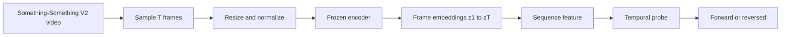

# Video Plan

## Goal

Build a small but useful video analysis stack around the frozen VICReg encoder.

The project should do three things:

1. train a temporal probe
2. show what the latent space is doing
3. present the result in a clean frontend

---

## What We Are Trying To Learn

The main question is:

> does the frozen video representation keep enough temporal order that a simple classifier can tell whether a clip is forward or reversed?

This is a diagnostic question.

It is not full video recognition.
It is not a world model.
It is a probe for temporal structure.

---

## Dataset

Use **Something-Something V2** for the first temporal probe.

Why this dataset:

- it is video-based
- it contains everyday actions
- order matters in many clips
- it is much better than static images for testing motion and temporal order

### Dataset Layout

Expected files:

- `data/something_v2/20bn-something-something-v2/`
- official Something-Something V2 annotation files for train / validation splits

The annotation files should provide:

- clip id
- action label or text description
- split

### Split Strategy

Keep the raw videos in one place.

Do not copy all videos into separate train / validation / test folders unless there is a strong reason to do so.

Instead, make a split manifest that points to the raw files.

Recommended structure:

- `data/something_v2/20bn-something-something-v2/` for raw videos
- `data/something_v2/splits/train.csv`
- `data/something_v2/splits/validation.csv`
- `data/something_v2/splits/test.csv`

The manifest is the source of truth.

### First ML Subset

Use a randomly chosen subset of 2,000 usable videos for the first ML pipeline.

Split those 2,000 videos into:

- train
- validation
- test

This subset is only for the probe training pipeline.

Important:

- 2,000 means 2,000 videos that actually decode and load correctly
- if some sampled raw candidates are missing or unusable, keep sampling until the valid subset reaches 2,000
- the split ratio applies to the final valid subset, not to the first raw draw
- the train / validation / test counts are derived automatically from the single subset size

The rest of the videos in `data/something_v2/` can stay available for manual inspection, frontend examples, and later experiments, but they should not be part of the first ML run unless explicitly added later.

Important:

- the split must be by video, not by frame
- all frames from a video must stay in the same split
- do not leak frames from one split into another

### Manifest Schema

Use a CSV manifest with one row per video.

Suggested columns:

- `video_id`: unique clip id
- `path`: relative or absolute path to the `.webm` file
- `split`: `train`, `validation`, or `test`
- `label`: original Something-Something class label or text label
- `num_frames`: total decoded frames if known
- `duration_sec`: clip duration if known

Optional columns:

- `subset`: marks whether the video belongs to the first 2,000-video ML subset
- `sample_start_frame`: optional starting frame for a fixed clip window
- `sample_end_frame`: optional ending frame for a fixed clip window

Example row:

- `video_id=74225`
- `path=data/something_v2/20bn-something-something-v2/74225.webm`
- `split=train`
- `label=spinning cube that quickly stops spinning`
- `num_frames=16`
- `duration_sec=5.0`

### Loader Rule

The loader should read the manifest first and then open the video from `path`.

It should not infer split membership from file names alone.

The manifest is the source of truth.

### Split Manifest Files

Use separate CSVs for the split views:

- `data/something_v2/splits/train.csv`
- `data/something_v2/splits/validation.csv`
- `data/something_v2/splits/test.csv`

These files should contain rows pointing to the raw videos.

Each row should include at least:

- `video_id`
- `path`
- `split`
- `label`

### How To Build The First 2,000-Video ML Subset

1. collect all candidate video rows from the raw Something-Something V2 manifest
2. sample candidate videos uniformly at random
3. decode each candidate and keep only usable videos
4. keep sampling until the valid pool reaches 2,000 videos
5. assign those 2,000 valid videos to train / validation / test by video id using a 70/20/10 rule
6. write the split CSVs

Suggested split ratio:

- 70% train
- 20% validation
- 10% test

For 2,000 videos, that is approximately:

- 1,400 train
- 400 validation
- 200 test

### Automatic Split Rule

If the user provides a single subset size `N`:

- train = floor(0.7 * N)
- validation = floor(0.2 * N)
- test = N - train - validation

This guarantees the three counts always sum to `N`.

### Reproducibility Rule

Use a fixed random seed when sampling the 2,000-video subset.

That way:

- the same subset can be regenerated
- probe results are comparable across runs
- the split can be audited later

### What Happens To The Remaining Videos

The remaining videos in the Something-Something V2 folder should stay outside the first ML pipeline.

They can still be used for:

- manual inspection
- frontend examples
- later scaling experiments

But they should not be pulled into the first probe run unless explicitly added later.

### Minimal Pipeline Summary

The first usable pipeline is:

1. raw videos in one folder
2. manifest file describing them
3. a sampled 2,000-video subset
4. train / validation / test split CSVs
5. loader reads the CSVs
6. probe trains on ordered frame features

### What We Use From The Dataset

For the forward-vs-reverse probe, we use:

- the video file
- the split
- the clip order

We do **not** use the action label as the first target.

Instead, we derive a binary temporal label:

- `0` = forward
- `1` = reversed

So the dataset is used as a source of ordered clips, not as a standard action-classification benchmark.

---

## Do We Use The Full Video?

No.

We use a short temporal window from each clip.

The reason is practical:

- the videos are long enough that full-sequence training would be expensive
- the probe only needs a short clip to test order
- fixed-length inputs make batching simpler

### Clip Sampling Rule

For each video:

1. sample a start point
2. take a contiguous window of `T` frames
3. decode those frames in order
4. resize them to the model input size

The same window is used for both probe labels.

### Recommended Frame Count

Start with:

- `T = 32`

This is a good first choice because it gives enough temporal context without making the probe too heavy.

### Frame Division Logic

If a clip has more than `T` frames:

- sample `T` evenly spaced frames from the chosen window

If a clip has fewer than `T` usable frames:

- repeat frames or pad by repeating the last frame

### Important Implementation Detail

Encode the forward frames once.

Then build the reversed sample by reversing the embedding order:

- forward sequence: `z1, z2, ..., zT`
- reversed sequence: `zT, zT-1, ..., z1`

That means:

- the encoder runs once per clip window
- the probe sees two orderings of the same frame embeddings
- the reversed sample does not require a second encoder pass

This is the simplest and cheapest way to test temporal order.

---

## Training Pipeline

The pipeline is:

1. sample a clip
2. decode it into frames
3. resize and normalize frames
4. pass each frame through the frozen encoder
5. collect frame embeddings in order
6. build a sequence feature for the probe
7. train a small classifier on top

### Concrete Training Script

The first training script should be:

- `scripts/video/run_video_temporal_probe.py`

Suggested CLI:

- `--checkpoint`: path to the frozen VICReg checkpoint
- `--data-root`: path to Something-Something V2 videos
- `--split`: `train`, `val`, or `test`
- `--num-frames`: number of frames per clip, default `32`
- `--batch-size`: batch size for feature extraction / probe training
- `--epochs`: probe training epochs
- `--lr`: learning rate for the probe
- `--limit`: optional cap on number of clips for a quick run
- `--cache-dir`: optional directory for cached frame embeddings
- `--output-dir`: where metrics and probe artifacts are written

What it does:

1. load the frozen VICReg checkpoint
2. load Something-Something V2 clips and splits
3. sample `T = 32` frames per clip
4. encode frames once with the frozen encoder
5. build forward and reversed sequence features
6. train a small classifier on the ordered features
7. write metrics and a saved probe to disk

### What Gets Saved

Save artifacts such as:

- `logs/video_temporal_probe/metrics.json`
- `logs/video_temporal_probe/probe.pt`
- `logs/video_temporal_probe/predictions.csv`
- `logs/video_temporal_probe/confusion_matrix.png`

Optional:

- `logs/video_temporal_probe/per_clip_features.npz`
- `logs/video_temporal_probe/training_curve.png`

### Rough Runtime

Very rough back-of-the-envelope numbers:

- feature extraction is the slow part
- the probe itself is fast
- 32-frame clips are a good tradeoff between signal and speed

On your GPU, a first pass over a moderate subset of clips should be practical in a single evening run.

The exact time depends mostly on:

- how many clips you use
- how long each clip is
- whether you cache frame embeddings
- how fast video decoding is on the machine

If we cache embeddings, later probe experiments should run much faster.

### What Happens During A Run

The training script has two main phases.

#### Phase 1: Encoding

This is the part you saw at `1452` samples.

For each sample:

1. load a video clip
2. decode frames
3. sample `T = 32` frames
4. send frames through the frozen encoder
5. flatten the ordered frame embeddings
6. store the feature and label

This phase is the slow one because it does video decoding and encoder forward passes.

#### Phase 2: Probe Training

After all features are collected:

1. build train / validation / test tensors
2. initialize the linear probe on GPU
3. train for the requested number of epochs
4. evaluate on validation and test sets
5. save the best probe checkpoint
6. write metrics and predictions to disk

#### Phase Order

The order is always:

1. encode clips
2. build features
3. train probe
4. evaluate
5. save model and reports

So if the progress bar is still on encoding, the probe training has not started yet.

### Diagram: Data Flow



### Diagram: Training Loop

```mermaid
sequenceDiagram
    participant Loader as Dataset loader
    participant Enc as Frozen encoder
    participant Probe as Temporal probe
    participant Opt as Optimizer

    Loader->>Loader: sample clip window
    Loader->>Enc: frames x1...xT
    Enc-->>Loader: embeddings z1...zT
    Loader->>Probe: sequence feature u
    Probe-->>Loader: y_hat
    Loader->>Opt: cross-entropy loss
    Opt->>Probe: update probe weights
    Note over Enc: encoder stays frozen
```

---

## Feature Choice

Do not use average pooling as the main probe input.

Average pooling removes order, so it is not useful for forward-vs-reverse.

### Main Probe Input

Use an order-sensitive representation instead, such as concatenation:

$$
\mathbf{u} = [\mathbf{z}_1;\mathbf{z}_2;\dots;\mathbf{z}_T] \in \mathbb{R}^{Td}
$$

where:

- $\mathbf{z}_t \in \mathbb{R}^{d}$ is the frozen embedding for frame $t$
- $\mathbf{u} \in \mathbb{R}^{Td}$ is the sequence feature

Then train:

$$
\hat{\mathbf{y}} = \mathrm{softmax}(W\mathbf{u} + \mathbf{b})
$$

with:

- $W \in \mathbb{R}^{2 \times Td}$
- $\mathbf{b} \in \mathbb{R}^{2}$

The label is:

- $y = 0$ for forward
- $y = 1$ for reversed

### Tensor Shapes

For one clip:

- video clip: `(T, 3, 96, 96)`
- encoder output per frame: `(d,)`
- all frame embeddings: `(T, d)`
- flattened sequence feature: `(T * d,)`

For a batch of `B` clips:

- batch features: `(B, T * d)`
- batch labels: `(B,)`
- probe logits: `(B, 2)`

This is why a single linear layer is enough for the first probe.
The probe is reading the ordered frame embeddings directly.

### Why Flattening Is Enough For A First Probe

Flattening keeps the frame order because the position of each frame embedding is preserved in the vector.

That means:

- frame 1 is always in the first block
- frame 2 is always in the second block
- ...
- frame `T` is always in the last block

So a linear classifier can learn weights that respond to order-sensitive patterns.

For the first version, this is enough to test whether temporal direction is readable.

### What A Slightly Better Model Would Be Later

Later, we can replace flattening with a small temporal model such as:

- a 1D temporal convolution
- a small GRU
- a small transformer encoder over frame embeddings

Those models can learn more structured motion features.
But for now, the linear flattening probe is the cleanest first check.

### Other Possible Probe Inputs

We may also test:

- frame differences
- first-last differences
- a tiny temporal model on top of frozen frame features

But the first useful version should stay simple.

---

## Probe Objective

The probe answers:

- can a small classifier tell whether the frozen representation still knows the clip order?

If yes:

- the representation keeps useful temporal information

If no:

- the representation may be mostly appearance-driven

### Loss

Use standard cross-entropy loss:

$$
\mathcal{L} = - \sum_{c \in \{0,1\}} y_c \log \hat{y}_c
$$

where:

- $\hat{\mathbf{y}}$ is the predicted probability vector
- $\mathbf{y}$ is the one-hot label vector

---

## Why This Matters

This gives us:

- a measurable temporal task
- a clean training pipeline
- a frontend story that matches the math

It is the first step toward video tasks that are actually useful.

---

## What The Frontend Should Show

For each clip, the frontend should show:

1. the video itself
2. the frame-by-frame latent trail
3. the forward vs reversed comparison
4. the probe prediction
5. nearby clips for context

The frontend is not the model.
It is the presentation layer for the model and the probe.

---

## Suggested File Layout

```text
docs/
  video/
    video_plan.md
    video_classification_thing.md
    frontend_implementation_plan.md

scripts/
  run_video_temporal_probe.py
  run_video_dynamics.py
  serve_video_demo.py

src/jepa_world_models/analysis/
  video_temporal_probe.py
  video_dynamics.py
  video_probing.py
```

---

## Next Useful Extensions

After forward-vs-reverse, the next tasks can be:

1. start / middle / end phase classification
2. motion type classification
3. short-horizon prediction
4. temporal retrieval

Those are more useful than the direction-only probe because they connect more directly to video understanding.

---

## Bottom Line

The plan is:

- use Something-Something V2
- sample short fixed-length windows
- encode frames with a frozen model
- keep frame order
- train a simple classifier to predict forward vs reversed
- show the latent trail and the comparison in the frontend

That is the clean first version of video temporal probing.

---

## First Training Run Recipe

1. make sure the Something-Something V2 video folder is present
2. point the script at the frozen VICReg checkpoint
3. start with a small clip limit for a smoke test
4. use `T = 32` frames per clip
5. train only the probe first
6. verify metrics and saved artifacts

Example shape:

- smoke test: a small subset of clips
- real run: a larger train split after the smoke test passes

The first run should confirm:

- videos load correctly
- embeddings are produced
- forward and reversed samples differ
- the probe loss decreases
- artifacts are saved to disk

