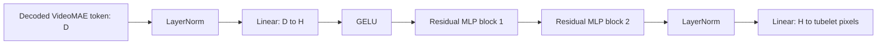

# Video Reconstruction Demo Plan

## Summary

Build a masked reconstruction demo on top of the pretrained VideoMAE model.

The demo shows:

1. original clip
2. masked clip
3. reconstructed clip

The goal is a visible, explainable artifact that makes the model’s behavior easy to inspect.

## Reconstruction Strategy

This first version uses the VideoMAE decoder as the main path:

- encode a pool of training clips with the pretrained VideoMAE encoder
- run the decoder on masked clips to produce token-level predictions
- fit a small tubelet decoder head that maps decoded tokens back to tubelet pixels
- copy visible tubelets from the input clip and fill masked tubelets from the head output

The older tubelet-bank retrieval path stays available as a fallback/debug mode, but the default demo should show the decoder output.

## Quality Upgrade

The pixel decoder is now a residual MLP rather than a single hidden layer:



Each residual block applies normalization, an expanded MLP, dropout, and a skip connection. The VideoMAE checkpoint remains frozen. Only this tubelet-to-pixel head is trained.

### Mathematical Formulation

Let a sampled video clip contain \(n_t\) RGB frames of height \(h\) and width \(w\). The clip is divided into tubelets with temporal length \(\tau\) and spatial patch size \(r \times r\).

The number of tubelets is

$$
N := \frac{n_t}{\tau}\frac{h}{r}\frac{w}{r}.
$$

Each tubelet contains \(\tau\) RGB patches. After flattening, tubelet \(i\) is the column vector

$$
\mathbf{x}_i \in \mathbb{R}^{q},
\qquad
q := 3\tau r^2.
$$

The entries of \(\mathbf{x}_i\) are normalized RGB values in the same space used to train VideoMAE. A mask set

$$
\mathcal{M} \subseteq \{1,\ldots,N\}
$$

contains the indices of the hidden tubelets. If the mask ratio is \(\rho \in (0,1)\), then approximately \(|\mathcal{M}| = \rho N\) tubelets are hidden.

The frozen VideoMAE encoder and decoder process the visible tubelets and produce one decoded representation for every location:

$$
\mathbf{z}_i \in \mathbb{R}^{d},
\qquad i \in \{1,\ldots,N\}.
$$

In the current model, \(d=192\). For a masked location \(i \in \mathcal{M}\), \(\mathbf{z}_i\) is VideoMAE's prediction of the missing tubelet in representation space. It is not yet an RGB patch.

The trainable pixel head is the vector-valued function

$$
\mathbf{h}_{\boldsymbol{\phi}} : \mathbb{R}^{d} \to \mathbb{R}^{q},
$$

where \(\boldsymbol{\phi} \in \mathbb{R}^{p}\) contains only the pixel-head parameters. Its output is

$$
\widehat{\mathbf{x}}_i
:=
\mathbf{h}_{\boldsymbol{\phi}}(\mathbf{z}_i)
\in \mathbb{R}^{q}.
$$

The VideoMAE parameters remain frozen. Gradient updates apply only to \(\boldsymbol{\phi}\).

For hidden width \(m\), the first projection is

$$
\mathbf{u}_i^{(0)}
:=
\operatorname{GELU}\!\left(
W_{\mathrm{in}}\operatorname{LN}(\mathbf{z}_i)+\mathbf{b}_{\mathrm{in}}
\right)
\in \mathbb{R}^{m},
$$

with

$$
W_{\mathrm{in}} \in \mathbb{R}^{m\times d},
\qquad
\mathbb{R}^{m\times d}\cdot\mathbb{R}^{d}
=
\mathbb{R}^{m}.
$$

Residual block \(\ell\) computes

$$
\mathbf{u}_i^{(\ell+1)}
:=
\mathbf{u}_i^{(\ell)}
+
W_{2}^{(\ell)}
\operatorname{GELU}\!\left(
W_{1}^{(\ell)}\operatorname{LN}(\mathbf{u}_i^{(\ell)})
+
\mathbf{b}_{1}^{(\ell)}
\right)
+
\mathbf{b}_{2}^{(\ell)},
$$

where

$$
W_{1}^{(\ell)} \in \mathbb{R}^{2m\times m},
\qquad
W_{2}^{(\ell)} \in \mathbb{R}^{m\times 2m}.
$$

Dropout is applied inside the residual branch during training and is disabled during reconstruction. The final projection is

$$
\widehat{\mathbf{x}}_i
=
W_{\mathrm{out}}\operatorname{LN}(\mathbf{u}_i^{(L)})
+
\mathbf{b}_{\mathrm{out}}
\in \mathbb{R}^{q},
$$

with

$$
W_{\mathrm{out}} \in \mathbb{R}^{q\times m},
\qquad
\mathbb{R}^{q\times m}\cdot\mathbb{R}^{m}
=
\mathbb{R}^{q}.
$$

The training objective is evaluated only at masked locations:

$$
\mathcal{L}_{\mathrm{recon}}(\boldsymbol{\phi})
:=
\frac{1}{|\mathcal{M}|q}
\sum_{i\in\mathcal{M}}
\left\|
\widehat{\mathbf{x}}_i-\mathbf{x}_i
\right\|^2.
$$

The gradient update is

$$
\boldsymbol{\phi}_{s+1}
\leftarrow
\boldsymbol{\phi}_{s}
-
\eta\,\nabla_{\boldsymbol{\phi}_{s}}
\mathcal{L}_{\mathrm{recon}},
$$

while the VideoMAE parameter vector is unchanged. Here \(s\) denotes the optimization step so that \(t\) remains available for video time indices.

The final reconstructed tubelet is

$$
\widetilde{\mathbf{x}}_i
:=
\begin{cases}
\widehat{\mathbf{x}}_i, & i\in\mathcal{M},\\
\mathbf{x}_i, & i\notin\mathcal{M}.
\end{cases}
$$

Thus, visible pixels are copied exactly from the input. Only hidden tubelets are generated by the learned pixel head.

### Connection to the Code

```text
clip                         # (B, T, 3, H, W)
recon_tokens, mask =
    reconstruct_tokens(...)  # recon_tokens: (B, N, d), mask: (N,)

tubelets =
    batch_patchify_clips(...) # (B, N, tau, 3, P, P)
targets = flatten(tubelets)  # (B, N, q)

predictions = pixel_head(
    recon_tokens[:, mask]
)                            # (B, |M|, q)

loss = mean_squared_error(
    predictions,
    targets[:, mask]
)
```

### Concrete Natural-Scene Example

Consider a short clip showing a deer walking through a forest while thin branches partially cross its body.

1. **Sample the clip.** The loader selects \(n_t=16\) frames and resizes each frame to \(224\times224\) pixels. The deer moves slightly to the right across the sequence while the background remains mostly stationary.

2. **Construct tubelets.** With \(\tau=2\) and \(r=16\), each tubelet covers two consecutive frames and one \(16\times16\) spatial location. The clip contains

   $$
   N
   =
   \frac{16}{2}\frac{224}{16}\frac{224}{16}
   =
   8\cdot14\cdot14
   =
   1568
   $$

   tubelets. Each flattened RGB target has

   $$
   q
   =
   3\cdot2\cdot16^2
   =
   1536
   $$

   entries, so \(\mathbf{x}_i\in\mathbb{R}^{1536}\).

3. **Hide part of the scene.** At a 50% random mask ratio, approximately \(784\) tubelets are hidden. Some masks cover the deer's torso, some cover moving legs, and others cover leaves, tree bark, or background sky. The model receives the remaining tubelets and their positions.

4. **Predict missing representations.** The frozen VideoMAE uses visible spatial and temporal context to produce \(\mathbf{z}_i\in\mathbb{R}^{192}\) for every hidden position. For a tubelet covering the moving front leg, useful context includes the leg's location in nearby frames, the deer's body, and the direction of motion. This does not guarantee that the representation contains exact colors or edges.

5. **Convert representations to pixels.** The residual pixel head maps

   $$
   \mathbb{R}^{192}\to\mathbb{R}^{1536}.
   $$

   It predicts the RGB values for both frames inside each missing tubelet. A good prediction may recover brown fur, part of a leg contour, and nearby green foliage. A weak prediction may produce a brown or green blur because pixel MSE rewards average plausible colors when exact details are uncertain.

6. **Assemble the video.** All unmasked tubelets are copied from the original clip. Predicted tubelets replace only the hidden locations. The resulting grid is rearranged into 16 reconstructed frames.

7. **Measure the hidden regions.** Suppose the masked pixels have

   $$
   \operatorname{MSE}_{\mathrm{pixel}}=0.01
   $$

   after RGB values are converted to \([0,1]\). Then

   $$
   \operatorname{PSNR}
   :=
   10\log_{10}\!\left(
   \frac{1^2}{\operatorname{MSE}_{\mathrm{pixel}}}
   \right)
   =
   10\log_{10}(100)
   =
   20\ \mathrm{dB}.
   $$

   If a better head reduces pixel MSE to \(0.001\), PSNR rises to \(30\ \mathrm{dB}\). The additional \(10\ \mathrm{dB}\) means ten times lower pixel MSE.

This example also shows the limitation of PSNR: the predicted deer may have the right average colors and a reasonable score while its leg boundary or motion still looks blurry. The metric and the rendered video must therefore be inspected together.

Training uses batches of clips, evaluates a held-out 10% validation split after every epoch, and restores the epoch with the lowest validation loss. Gradient clipping limits unstable updates.

The head cache is keyed by:

- VideoMAE checkpoint path, size, and modification time
- dataset split and subset size
- image and frame dimensions
- mask ratio and mask mode
- hidden dimension, residual-block count, and dropout
- epochs, learning rate, and random seed

Changing any of these settings produces a new cache file instead of silently loading an incompatible head.

## Why Recon Looks Blurry

VideoMAE is mainly a representation learner. That means its default objective is to make masked video tokens useful for downstream tasks, not to produce sharp RGB reconstructions.

The current reconstruction quality is weak for the usual reasons:

- the backbone is frozen
- the decoder head is small compared with the complexity of video synthesis
- pixel MSE rewards average colors, not crisp edges
- heavy masking forces the model to guess large hidden regions
- tubelets are coarse, so fine texture is already partially lost before the head sees them

In practice, that means the output often has the right layout and rough color blocks, but not sharp motion boundaries or clean texture.

## Techniques To Improve Reconstruction

The best fixes, in priority order, are:

1. **Lower the mask ratio for the demo path**
   - This is the fastest way to make outputs look better.
   - Keep a higher mask ratio for representation experiments if you want.
   - For the UI, a lower ratio makes the reconstruction visually easier to trust.

2. **Use a stronger reconstruction head**
   - Replace the current residual MLP with a small transformer decoder or a deeper decoder stack.
   - That gives the model more capacity to mix context across masked tubelets.
   - This helps especially when motion crosses object boundaries.

3. **Predict richer targets than raw RGB**
   - Pixel-only supervision is the main reason for blur.
   - Better targets include latent features, quantized visual tokens, or a mix of pixel and feature losses.
   - This is usually better than asking the head to directly synthesize every pixel from scratch.

4. **Add a perceptual term**
   - Combine pixel MSE with a perceptual loss on reconstructed patches.
   - MSE can be kept for stability, but perceptual loss helps the output look sharper.
   - This is useful when the rendered result matters more than exact numeric fit.

5. **Weight motion regions more heavily**
   - Static background is much easier than moving edges.
   - Give extra weight to regions that change over time or that belong to moving objects.
   - This can help with wheel edges, hands, faces, legs, and object boundaries.

6. **Use decoder-side masking or smarter token selection**
   - Not all tubelets matter equally.
   - Focus compute on informative regions instead of treating every location the same.
   - This is especially useful when the scene has a lot of empty or repetitive background.

7. **Use longer temporal context**
   - Short clips are easier to guess, but they also give less motion history.
   - Longer clips help the model infer how an object is moving through time.
   - This is important when the goal is visual continuity rather than just local patch completion.

8. **Fine-tune a small part of the backbone**
   - Keep most of VideoMAE frozen, but allow a late block or the decoder to adapt.
   - This can improve reconstructions if the frozen features are too abstract.
   - Use this only if the frozen-backbone approach is still too blurry.

For this repo, the most practical sequence is:

- first lower the mask ratio
- then strengthen the decoder head
- then add a perceptual or motion-aware loss
- only then consider partial fine-tuning

## Lessons Learned

The reconstruction exercise surfaced a few practical points:

- VideoMAE is useful for representation learning, but sharp pixel reconstruction is not its default strength.
- A frozen backbone plus a small pixel head tends to recover layout and color blocks before it recovers crisp edges.
- Pixel MSE and PSNR are useful diagnostics, but they do not tell the whole story for visual quality.
- Heavy masking makes the demo more interesting scientifically, but it can make the output look much worse.
- If the goal is a convincing demo, a lower mask ratio and a stronger decoder are more valuable than chasing a single score.
- The most readable result is one where the user can compare original, masked, and reconstructed clips side by side and immediately see what was lost and what came back.
- For this repo, reconstruction should be treated as an interpretability and debugging tool first, and only second as a fidelity benchmark.

## Quality Metrics

Metrics are computed only on masked tubelets because visible tubelets are copied from the input:

- `reconstruction_loss`: mean squared error in normalized model-input space
- `masked_pixel_mse`: mean squared error after converting predictions back to the `[0, 1]` pixel range
- `psnr_db`: peak signal-to-noise ratio from masked-pixel MSE; higher is better

PSNR makes runs with different head settings easier to compare, but the videos remain the primary evaluation because a low pixel error can still produce blurry motion.

## Frontend Flow

- user uploads a short video
- user chooses a mask ratio and mask mode (the demo defaults to a gentler 30 percent mask so reconstruction is easier to inspect)
- backend reconstructs the clip
- frontend displays:
  - original video
  - masked video
  - reconstructed video
  - frame-strip previews
  - a mask map showing which tubelets were hidden

## Entry Points

- CLI demo:
  - `uv run python scripts/video/run_video_reconstruction.py --checkpoint logs/videomae_large/best_videomae.pt --reconstruction-mode decoder --subset-size 512 --head-epochs 10`
- Local UI server:
  - `uv run python scripts/video/serve_video_reconstruction.py --checkpoint logs/videomae_large/best_videomae.pt --reconstruction-mode decoder --subset-size 512 --head-epochs 10`

The first run trains and caches the head. Later runs with the same settings load that cache.

## Test Plan

- upload a known short clip
- confirm the masked region is visible
- confirm the reconstructed output is written and playable
- confirm the frontend renders the three video panes and the mask map

## Assumptions

- reconstruction means masked reconstruction, not free-form generation
- the first demo is decoder-first and frontend-visible
- a separate browser-based UI is worth it because this is the first time the model will produce an obviously visual output


