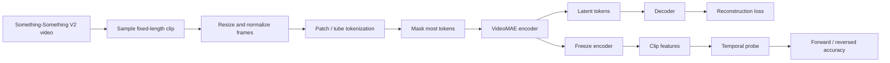

# VideoMAE Track Implementation Plan

## Summary

This repo will gain a separate **VideoMAE track** for learning temporal video representations on Something-Something V2.

The first goal is a small, understandable, end-to-end system:

1. sample clips from the existing video dataset
2. pretrain a VideoMAE model with masked reconstruction
3. save encoder checkpoints and logs
4. run the existing temporal-probe style evaluation on the learned features

This track is intentionally separate from the VICReg image-encoder path.

## What We Are Building

### 1. VideoMAE pretraining

- Input: short fixed-length clips sampled from the dataset
- Objective: mask a large fraction of spatiotemporal tokens and reconstruct them
- Output: a pretrained video encoder plus a decoder used only during pretraining
- Saved artifacts:
  - `best_videomae.pt`
  - `videomae_final.pt`
  - training metrics JSON

## Math View

Let a video clip be a sequence of frames

$$
\mathbf{x} = (x_1, x_2, \ldots, x_T), \qquad x_t \in \mathbb{R}^{3 \times H \times W}.
$$

The VideoMAE encoder first splits the clip into spatiotemporal tokens. After patching and tubelet embedding, the input becomes a token sequence

$$
\mathbf{u} \in \mathbb{R}^{N \times d},
$$

where:

- $N$ is the number of visible video tokens before masking
- $d$ is the embedding dimension

We sample a binary mask

$$
\mathbf{m} \in \{0,1\}^{N},
$$

where $m_i = 1$ means token $i$ is hidden and $m_i = 0$ means token $i$ is visible.

The model keeps only the visible tokens and encodes them:

$$
\mathbf{z} = f_{\theta}(\mathbf{u}_{\text{visible}}), \qquad \mathbf{z} \in \mathbb{R}^{N_v \times d},
$$

where $N_v$ is the number of visible tokens and $f_{\theta}$ is the VideoMAE encoder.

The decoder then predicts the full token set:

$$
\hat{\mathbf{u}} = g_{\phi}(\mathbf{z}), \qquad \hat{\mathbf{u}} \in \mathbb{R}^{N \times d},
$$

where $g_{\phi}$ is the decoder.

The reconstruction objective compares the predicted tokens to the original tokens:

$$
\mathcal{L}_{\text{recon}}(\theta,\phi)
=
\frac{1}{N}
\sum_{i=1}^{N}
\left\|
\hat{\mathbf{u}}_i - \mathbf{u}_i
\right\|_2^2.
$$

In practice, the loss is most useful when it emphasizes the masked tokens, because the visible tokens are already given to the encoder. So a masked-token version is:

$$
\mathcal{L}_{\text{masked}}(\theta,\phi)
=
\frac{1}{\sum_i m_i}
\sum_{i=1}^{N}
m_i
\left\|
\hat{\mathbf{u}}_i - \mathbf{u}_i
\right\|_2^2.
$$

Training updates the parameters by gradient descent:

$$
\theta_{t+1} \leftarrow \theta_t - \eta \nabla_{\theta_t}\mathcal{L}_{\text{masked}}, \qquad
\phi_{t+1} \leftarrow \phi_t - \eta \nabla_{\phi_t}\mathcal{L}_{\text{masked}}.
$$

The important point is that the model never sees labels during pretraining. It only learns to predict missing video content from the visible part of the clip.

## Tubelets, Patches, and Shapes

VideoMAE does not read the full clip as one dense tensor all at once. It first turns the clip into smaller blocks.

### 1. Patch the image plane

Each frame

$$
x_t \in \mathbb{R}^{3 \times H \times W}
$$

is split into non-overlapping spatial patches of size $P \times P$.

The number of spatial patches per frame is:

$$
N_s = \frac{H}{P} \cdot \frac{W}{P}.
$$

### 2. Group frames into tubelets

A tubelet is a small 3D block:

- a few consecutive frames
- plus a spatial patch location

If the tubelet length is $\tau$, then each tubelet covers:

$$
\tau \times P \times P
$$

pixels in the video volume.

For a clip of $T$ frames, the number of temporal groups is:

$$
N_t = \frac{T}{\tau}.
$$

So the total number of video tokens is:

$$
N = N_t \cdot N_s
=
\frac{T}{\tau} \cdot \frac{H}{P} \cdot \frac{W}{P}.
$$

### 3. Token embedding

Each tubelet is flattened and mapped to an embedding vector:

$$
\mathbf{u}_i = E \, \mathrm{flatten}(\text{tubelet}_i) + \mathbf{b},
$$

where:

- $E$ is the learned projection matrix
- $\mathbf{u}_i \in \mathbb{R}^d$
- $d$ is the embedding size

Stacking all tubelets gives:

$$
\mathbf{u} \in \mathbb{R}^{N \times d}.
$$

### 4. Masking

We sample a random subset of tokens to hide.

Let $V$ be the visible index set and $M$ the masked index set, with

$$
V \cup M = \{1,\dots,N\}, \qquad V \cap M = \emptyset.
$$

Then:

$$
\mathbf{u}_{\text{visible}} = \{\mathbf{u}_i : i \in V\}.
$$

The encoder sees only $\mathbf{u}_{\text{visible}}$.

### 5. Decoder target

The decoder predicts all tokens:

$$
\hat{\mathbf{u}} = g_{\phi}(f_{\theta}(\mathbf{u}_{\text{visible}})).
$$

The reconstruction loss is usually computed on the masked positions:

$$
\mathcal{L}_{\text{masked}}
=
\frac{1}{|M|}
\sum_{i \in M}
\left\|
\hat{\mathbf{u}}_i - \mathbf{u}_i
\right\|_2^2.
$$

## Math to Pseudocode

The actual flow is:

```text
input clip x: (B, T, 3, H, W)

1. split clip into tubelets
   tokens = patch_embed(x)
   tokens shape -> (B, N, d)

2. add positional information
   tokens = tokens + pos_embed

3. sample mask
   visible_tokens, mask = mask_tokens(tokens)
   visible_tokens shape -> (B, Nv, d)
   mask shape -> (B, N)

4. encode visible tokens
   latent = encoder_blocks(visible_tokens)
   latent shape -> (B, Nv, d)

5. decode to full token space
   recon = decoder(latent)
   recon shape -> (B, N, d)

6. compute masked reconstruction loss
   loss = mse(recon[mask == 1], tokens[mask == 1])
```

## Why Tubelets Instead of Single Frames

If we used only individual frames, the model would mostly learn appearance.

Tubelets force the model to observe:

1. a local object patch
2. across a short time interval

That makes the token represent a small piece of motion, not just a static image patch.

This is why tubelets are important for video understanding.

## Why This Helps

The pretraining objective forces the encoder to capture:

1. what objects are present
2. where they are in the frame
3. how they move across time
4. what parts of the clip are consistent with the rest of the clip

That is exactly the kind of structure we want before any temporal probe or downstream task.

## Concrete Example: 10 Frames of Size 224 x 224

Take a clip with:

- `T = 10` consecutive frames
- each frame is `224 x 224`
- channels = `3`

So the input clip is:

$$
\mathbf{x} \in \mathbb{R}^{10 \times 3 \times 224 \times 224}
$$

Now choose:

- patch size `P = 16`
- tubelet length `\tau = 2`

### Step 1: Split each frame into spatial patches

Each `224 x 224` frame becomes a `14 x 14` patch grid because:

$$
224 / 16 = 14.
$$

So each frame has:

$$
14 \times 14 = 196
$$

spatial patches.

### Step 2: Group consecutive frames into tubelets

A tubelet is a small 3D block:

- `\tau = 2` consecutive frames
- one spatial patch location
- patch size `16 x 16`

So one tubelet covers:

$$
2 \times 16 \times 16
$$

pixels in the video volume, per color channel.

For a fixed spatial location, the 10 frames are grouped as:

1. frames 1 and 2
2. frames 3 and 4
3. frames 5 and 6
4. frames 7 and 8
5. frames 9 and 10

So with `T = 10` and `\tau = 2`:

$$
10 / 2 = 5
$$

temporal groups.

### Step 3: Count total tubelets

You have:

- `5` temporal groups
- `196` spatial patches per frame

So total tubelets are:

$$
5 \times 196 = 980
$$

Thus the clip becomes:

$$
\mathbf{u} \in \mathbb{R}^{980 \times d}
$$

after embedding, where `d` is the token dimension.

### Step 4: What one tubelet contains

Pick:

- spatial patch at row `i`, column `j`
- time block covering frames `1` and `2`

Then the tubelet is:

$$
\text{tubelet}_{1,i,j} \in \mathbb{R}^{2 \times 3 \times 16 \times 16}
$$

It contains the same spatial region across two consecutive frames.

### Step 5: Pseudocode view

```text
input clip x: (10, 3, 224, 224)

for t in {1..10}:
    split frame t into 14 x 14 patches of size 16 x 16

group frames into pairs:
    (1,2), (3,4), (5,6), (7,8), (9,10)

for each spatial patch location:
    make a tubelet from that patch across the 2 frames

result:
    5 temporal blocks × 196 spatial patches = 980 tubelets

each tubelet -> flatten -> linear projection -> token embedding
```

### Step 6: What this means in plain language

- patch = a small square in one frame
- tubelet = the same small square tracked across a short stretch of time
- token = the learned vector representation of that tiny video block

That is the object VideoMAE works with before masking and reconstruction.

## Probe Link

After pretraining, the encoder is frozen and we use its output as a feature extractor.

If the frozen features are useful, then a simple probe can separate forward clips from reversed clips:

$$
\hat{y} = \mathrm{softmax}(W \mathbf{z} + b).
$$

Here the probe is not learning video structure from scratch. It is only testing whether the structure is already present in the VideoMAE representation.

### 2. Downstream temporal probe

- Freeze the pretrained encoder
- Extract per-clip temporal features
- Train a simple forward-vs-reversed probe
- Save the probe model separately from the VideoMAE checkpoint

### 3. Frozen-encoder evaluation

- Freeze the pretrained VideoMAE encoder
- Extract clip features
- Train the temporal probe on top of those features
- Report train/val/test accuracy for forward-vs-reversed clips

### 4. Separate repo surface area

- New script entrypoint for VideoMAE pretraining
- New module for VideoMAE model/training helpers
- New docs under `docs/video/`
- Separate output directory so the VideoMAE work does not collide with VICReg artifacts

## Data Flow



## Model Shape

### Encoder

- A transformer-based video encoder
- Learns from visible spatiotemporal tokens only
- Kept for downstream probing after pretraining

### Decoder

- Lightweight reconstruction head
- Exists only for masked-token prediction
- Not used for downstream evaluation

### Probe

- A small classifier trained on frozen clip features
- Used to test whether the learned representation preserves temporal order
- The probe is separate from the encoder

## Planned Repository Changes

### Training entrypoint

- Add a VideoMAE pretraining script with a clear CLI
- Parameters should include:
  - checkpoint path
  - data root
  - source split
  - clip length
  - masking ratio
  - batch size
  - epochs
  - learning rate
  - output directory

### Core implementation module

- Add a module for:
  - clip sampling
  - VideoMAE masking
  - encoder/decoder forward pass
  - loss computation
  - checkpoint save/load
  - temporal feature extraction for the probe

### Evaluation reuse

- Reuse the existing temporal-probe style evaluation flow
- The only change is the backbone that produces the features
- Save the temporal probe under its own output directory so the artifacts remain easy to compare

## First Run Recipe

The first training pass should be small and easy to verify:

1. use a small subset of clips
2. confirm token shapes and masking
3. run a short pretraining job
4. inspect reconstruction loss
5. freeze the encoder
6. run forward-vs-reverse probe evaluation

## Scale-Up Defaults

The next run should use a larger slice than the smoke test:

- pretraining subset: about 1,000 clips
- pretraining epochs: about 5
- probe subset: about 2,000 clips

That keeps the pipeline unchanged while giving the model and probe more signal.

## Larger-Run Notes

- cache the usable sample manifest so repeated runs do not rescan the dataset
- load only the sampled frames needed for each clip
- keep VideoMAE pretraining and temporal probing in separate output directories

## Test Plan

- Smoke test:
  - clip loading
  - mask creation
  - encoder forward pass
  - decoder forward pass
- Training test:
  - one short run produces checkpoints and metrics
- Evaluation test:
  - frozen encoder features can be extracted
  - probe training runs end to end
  - train/val/test metrics are written

## Assumptions

- This is a new video track, not a rewrite of VICReg.
- The first implementation should prioritize clarity over maximizing scale.
- The repo will keep the current probing pipeline and add VideoMAE alongside it.
