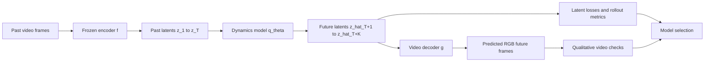
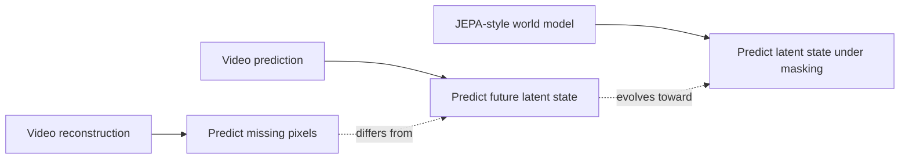
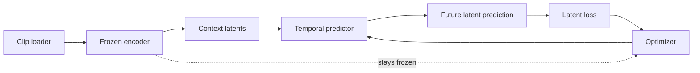
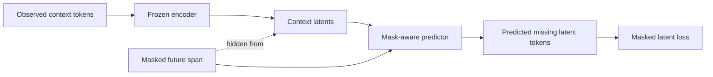

# JEPA-Style World Model Plan

## Goal

Build a video world model that predicts latent future state and decodes it back into video frames.

The project should answer a narrower but more useful question than reconstruction:

> given a short history of video, can the model predict what comes next in representation space?

This is the first step toward a two-stage video world model:

- encode the observed past into latent state
- predict future latent dynamics
- decode the predicted latents back into video space
- keep the encoder mostly frozen at first
- evaluate whether the predicted latent trajectory preserves scene structure and temporal order

The reconstruction demo remains useful as a diagnostic, but it is not the main objective anymore.

## Two-Stage Pipeline



The intended flow is:

- observe a short clip
- encode it into a latent sequence
- predict the future latent state
- decode predicted latents into RGB frames
- evaluate the prediction in both latent space and video space
- use probes, retrieval, and rollout checks to judge whether the representation is actually useful

---


## What This Is Not

This plan is not:

- free-form video generation
- pixel-level autoregressive modeling
- a diffusion model for video synthesis
- a full action-conditioned robotics world model

It is a compact, testable latent dynamics project that fits the current repository and can grow into those directions later.

### Comparison Diagram



The key distinction is:

- reconstruction fills in pixels that were hidden
- prediction forecasts what comes next
- JEPA-style modeling predicts the missing latent structure, not necessarily the RGB output

---

## Starting Point

The repository already has:

- a VideoMAE reconstruction demo
- a frozen-video-encoder workflow
- dataset loading and clip sampling utilities
- a browser-visible artifact pipeline

That gives us the right foundation for a latent world model because we already know how to:

- load clips
- sample tubelets or frame windows
- encode video with a frozen backbone
- save artifacts for inspection

The next step is to move from "what does the masked clip look like?" to "what future latent state is implied by the observed clip?"

---

## Core Idea

Let a short clip window be represented by frames

$$
\mathbf{x}_{1:T} := (\mathbf{x}_1, \mathbf{x}_2, \ldots, \mathbf{x}_T)
$$

where each frame is an RGB tensor and $T$ is the number of observed frames.

A frozen encoder maps the clip to a latent sequence

$$
\mathbf{z}_{1:T} := (\mathbf{z}_1, \mathbf{z}_2, \ldots, \mathbf{z}_T),
\qquad
\mathbf{z}_t \in \mathbb{R}^{d}.
$$

The world model learns a predictor

$$
\mathbf{q}_{\boldsymbol{\theta}} : \mathbb{R}^{T \times d} \to \mathbb{R}^{K \times d}
$$

that predicts a future latent block

$$
\widehat{\mathbf{z}}_{T+1:T+K}
:=
\mathbf{q}_{\boldsymbol{\theta}}(\mathbf{z}_{1:T}).
$$

The encoder stays frozen initially. Only $\boldsymbol{\theta}$ is trained.

The central question is whether $\widehat{\mathbf{z}}_{T+1:T+K}$ is close to the true future latent block

$$
\mathbf{z}_{T+1:T+K}.
$$

### Training Loop Diagram



The loop is intentionally small:

- decode a clip window
- encode the observed context
- predict the future latent block
- compute latent loss
- update only the predictor

---

## Why This Is The Right Next Step

This is a better fit for JEPA-style modeling because:

- the target is latent structure, not RGB detail
- the objective can be evaluated at multiple horizons
- the model can learn dynamics without needing to synthesize every pixel
- the same latent space can support probing, retrieval, planning, and control later

Pixel reconstruction asks the model to recover everything.
Latent prediction asks it to recover what matters.

---

## First Task

The first concrete task should be:

**Predict the next latent block from a short observed history, then decode it back into RGB frames.**

That means:

- input: past clip window
- target: the latent representation of the next clip window
- output: a vector or token block in the same latent space
- decoder: map predicted latents back to video frames
- loss: compare predicted and target latents, then inspect the decoded frames

This is the simplest useful world-model benchmark.

---

## Data Format

Use short clips from the existing video dataset pipeline.

For one video, sample a contiguous window of $T + K$ frames:

$$
\mathbf{x}_{1:T+K}.
$$

Split the window into:

- context: $\mathbf{x}_{1:T}$
- future target: $\mathbf{x}_{T+1:T+K}$

The model sees only the context during training input. The future is reserved for prediction targets.

### Recommended First Settings

- context length: `T = 8` or `T = 16`
- prediction horizon: `K = 4`
- image size: keep the current video pipeline default
- frame sampling: reuse the existing clip sampler

The exact values can be tuned after a smoke test.

---

## Latent Representation

The simplest latent choice is to reuse the existing frozen VideoMAE encoder output.

For each input clip, let the encoder produce a token sequence

$$
\mathbf{z} \in \mathbb{R}^{N \times d},
$$

where:

- $N$ is the number of latent tokens
- $d$ is the token dimension

For a video window, the latent state may also be pooled into a clip-level embedding

$$
\bar{\mathbf{z}} = \frac{1}{N}\sum_{i=1}^{N} \mathbf{z}_i \in \mathbb{R}^{d}.
$$

The first implementation should start with one target: a future latent block that can be decoded back into RGB frames.

If that works, we can later compare:

- token-level latent prediction
- clip-level latent prediction
- multi-scale latent prediction

---

## Model Shape

The world model should have three parts:

1. a frozen video encoder
2. a latent aggregator
3. a latent predictor

### Encoder

The encoder maps the observed clip to latent tokens:

$$
\mathbf{z}_{1:T} = \mathbf{f}(\mathbf{x}_{1:T})
$$

with $\mathbf{f}$ frozen at the start.

### Aggregator

The aggregator compresses the context into a state vector

$$
\mathbf{s} = g(\mathbf{z}_{1:T}) \in \mathbb{R}^{h}.
$$

Good first choices for $g$:

- mean pooling over time
- attention pooling
- a small temporal transformer

### Predictor

The predictor maps state to future latent targets:

$$
\widehat{\mathbf{z}}_{T+1:T+K} = \mathbf{q}_{\boldsymbol{\theta}}(\mathbf{s}).
$$

The predictor should be small enough to train quickly but expressive enough to use temporal context.

---

## Candidate Architectures

### Option 1: MLP Baseline

Use pooled context embeddings and a residual MLP head.

Pros:

- easiest to implement
- good smoke test
- fast to train

Cons:

- weak temporal structure
- limited horizon modeling

### Option 2: Temporal Transformer

Feed the ordered latent sequence into a small transformer encoder and predict future latent blocks.

Pros:

- order-aware
- better suited for dynamics
- closer to a JEPA-style latent model

Cons:

- more moving parts
- needs positional encoding and padding logic

### Option 3: Latent-to-Latent Cross-Attention

Use context latents as keys and values, then decode a learned future query set.

Pros:

- strong for masked prediction
- aligns well with JEPA-like design

Cons:

- more complex than needed for the first pass

### Recommendation

Start with the temporal transformer or a very small cross-attention predictor.

If the goal is JEPA-style learning, the predictor should respect order and learn to fill in missing future latent content, not just collapse the sequence into one vector.

---

## Prediction Targets

The target should be a latent tensor, not pixels. The decoder is what turns those predicted latents back into the original visual space.

Possible targets:

1. **future clip embedding**
   - one vector per future window
   - simplest
2. **future token grid**
   - more structured
   - closer to masked prediction
3. **multi-scale latent targets**
   - coarse target plus fine target
   - useful later

### Recommended First Target

Predict the future clip embedding

$$
\bar{\mathbf{z}}_{T+1:T+K} \in \mathbb{R}^{d}
$$

or a small set of pooled latent vectors.

Once that works, extend to token-level prediction.

---

## Loss Design

The default objective should compare predicted and target latent representations.

### Basic Latent Regression

Use mean squared error:

$$
\mathcal{L}_{\mathrm{pred}}
:=
\frac{1}{d}
\left\|
\widehat{\mathbf{z}} - \mathbf{z}
\right\|^2
$$

for a single target vector, or average over the future horizon for a block target.

### Normalized Latent Loss

If latent magnitude varies too much, use normalized vectors:

$$
\bar{\mathbf{z}} := \frac{\mathbf{z}}{\|\mathbf{z}\|}
$$

and compare normalized predictions and targets.

For a batch of predicted future latents

$$
\widehat{Z} \in \mathbb{R}^{B \times K \times D}
$$

and targets

$$
Z \in \mathbb{R}^{B \times K \times D},
$$

the implementation flattens the batch and horizon dimensions into vectors

$$
\widehat{\mathbf{u}}_i, \mathbf{u}_i \in \mathbb{R}^{D},
\qquad i = 1, \ldots, BK.
$$

The logged metrics are then:

$$
\mathrm{latent\_mse}
=
\frac{1}{BKD}
\sum_{i=1}^{BK}
\left\|\widehat{\mathbf{u}}_i - \mathbf{u}_i\right\|^2,
$$

$$
\mathrm{normalized\_latent\_mse}
=
\frac{1}{BKD}
\sum_{i=1}^{BK}
\left\|
\frac{\widehat{\mathbf{u}}_i}{\|\widehat{\mathbf{u}}_i\|}
-
\frac{\mathbf{u}_i}{\|\mathbf{u}_i\|}
\right\|^2,
$$

$$
\mathrm{cosine\_similarity}
=
\frac{1}{BK}
\sum_{i=1}^{BK}
\frac{\widehat{\mathbf{u}}_i^\top \mathbf{u}_i}{\|\widehat{\mathbf{u}}_i\|\,\|\mathbf{u}_i\|}.
$$

So the cosine similarity is between the predicted latent vector and the true latent vector at the same future position, averaged over the whole batch and horizon.

### Training Objective

The model minimizes a mixed latent regression loss:

$$
\mathcal{L}
=
\underbrace{\mathrm{MSE}(\mathrm{normalize}(\widehat{Z}), \mathrm{normalize}(Z))}_{\text{direction matching}}
+
0.1\,\underbrace{\mathrm{MSE}(\widehat{Z}, Z)}_{\text{magnitude matching}}.
$$

This objective says: first match the direction of the future latent vectors, then lightly penalize magnitude error as well. In practice, this is a simple regression objective in latent space, not a contrastive or probabilistic loss.

### Contrastive Alternative

Another option is to treat the future latent as the positive example and other samples in the batch as negatives.

That gives a latent matching loss of the InfoNCE type.

This may work better if direct regression collapses or becomes too blurry in latent space.

### Variance or Regularization Terms

If the predictor starts collapsing to a constant latent, add:

- variance regularization
- covariance regularization
- predictor output normalization

The main thing is to avoid a trivial "average future" solution.

---

## Multi-Horizon Training

The world model should eventually predict several horizons.

For horizons $k \in \{1, 2, 4, 8\}$, define:

$$
\widehat{\mathbf{z}}_{T+k} = \mathbf{q}^{(k)}_{\boldsymbol{\theta}}(\mathbf{s})
$$

and train with a weighted sum:

$$
\mathcal{L}
:=
\sum_{k} \lambda_k \mathcal{L}_k.
$$

Where $\lambda_k$ can decay with horizon so that the immediate future is not ignored.

This is important because one-step prediction can look good while longer rollouts fail.

---

## Rollout Training

After the first direct-prediction benchmark, add rollout prediction:

$$
\widehat{\mathbf{s}}_{t+1} = \mathbf{q}_{\boldsymbol{\theta}}(\widehat{\mathbf{s}}_{t}),
\qquad
\widehat{\mathbf{s}}_{t+2} = \mathbf{q}_{\boldsymbol{\theta}}(\widehat{\mathbf{s}}_{t+1}),
\quad \ldots
$$

This tests whether the latent dynamics are stable over time.

The evaluation should report:

- one-step error
- multi-step error
- latent drift over rollout length
- retrieval quality under rollout

If the latent state collapses during rollout, that is a useful diagnostic.

---

## Temporal Masking

JEPA-style training becomes more interesting when the model must infer hidden parts of the latent sequence.

Instead of always predicting the next clip, randomly mask part of the latent timeline:

- hide middle blocks
- hide random future blocks
- hide contiguous spans

Then train the predictor to recover the missing latent tokens.

This gives a masked latent prediction objective:

$$
\mathcal{M} \subseteq \{1, \ldots, N\}
$$

and the loss is computed only on hidden positions.

This is the closest conceptual bridge from the current reconstruction work to a JEPA-like world model.

### Masked JEPA Variant Diagram



This variant is the bridge from next-step prediction to JEPA-style masked latent completion:

- the model sees context latents
- a future span is hidden
- the predictor fills in the missing latent block
- the loss is computed only on the hidden positions

---

## Motion And Action Conditioning

The first version should be unconditional in the sense that it predicts future latent state from observed latent state only.

Later, add conditioning signals:

- action labels
- camera motion
- inferred motion tokens
- discrete control inputs

If the dataset does not expose actions, use motion proxies:

- frame deltas
- optical flow statistics
- object motion clusters
- temporal offset embeddings

This makes the model more useful for planning and control.

---

## Evaluation Plan

The evaluation should answer whether the latent world model is actually learning structure.

### 1. Latent Prediction Error

Report:

- mean squared error in latent space
- cosine similarity between the predicted future latent vector and the true future latent vector at the same horizon step
- normalized prediction error after unit-normalizing each latent vector
- decoded-frame quality checks

The learned model is compared against simple baselines on the same target future block:

- `repeat_last`: repeat the final observed latent vector across the future horizon
- `mean_context`: repeat the mean of the observed context latents across the future horizon

A learned model is only useful if it improves on these baselines in a stable way, especially on validation and test splits.

Report:

- mean squared error in latent space
- cosine similarity
- normalized prediction error
- decoded-frame quality checks

### 2. Multi-Step Stability

Report error at horizons:

- 1 step
- 2 steps
- 4 steps
- 8 steps

### 3. Representation Probes

Freeze the model and train small probes for:

- temporal order
- motion direction
- clip retrieval
- action classification if labels are available

### 4. Qualitative Checks

Inspect:

- nearest-neighbor latent retrieval
- decoded latent summaries if a lightweight decoder exists
- rollout consistency over time

The model should be judged by both numbers and behavior.

---

## Frontend Story

The frontend should shift from reconstruction to latent dynamics.

Useful panels:

1. original clip
2. masked or context-only clip
3. predicted future latent summary
4. nearest neighbor future clip
5. rollout horizon comparison

For a human-readable demo, the frontend can still show reconstructed pixels as a diagnostic layer, but the main visual story should be:

- what the model saw
- what latent future it predicted
- what actually happened

---

## Suggested File Layout

```text
docs/
  video/
    world_models/
      world_model_plan.md

scripts/
  run_video_world_model.py
  run_video_rollout_probe.py
  serve_video_world_model.py

src/jepa_world_models/analysis/
  video_world_model.py
  video_rollout.py
  video_latent_probing.py

tests/analysis/
  test_video_world_model.py
```

This keeps the world-model work separate from reconstruction while still reusing the same dataset and video loading utilities.

---

## First Implementation Milestone

The first milestone should be small and concrete:

1. load a short clip
2. encode the clip with the frozen video backbone
3. build a latent predictor head
4. predict the next latent block
5. report latent MSE and cosine similarity
6. save a checkpoint and metrics

This is enough to prove the pipeline works.

### First Run Command

PowerShell one-liner for a small smoke test:

```powershell
uv run python scripts/run_video_world_model.py --checkpoint logs/videomae_large/best_videomae.pt --data-root data --source-split train --subset-size 64 --context-seconds 5.0 --future-seconds 1.5 --sample-fps 4.0 --feature-batch-size 1 --batch-size 8 --epochs 3 --output-dir logs/video_world_model --cache-dir logs/video_world_model/cache
```

If you want a gentler GPU smoke test, reduce `--subset-size` to `32` and `--batch-size` to `4`.


### CLI Reference

The training entrypoint is `scripts/run_video_world_model.py`. It converts the human-friendly time arguments into frame counts and then calls the latent world-model trainer.

The conversion is:

$$
T_c = 2\left\lceil \frac{\mathrm{context\_seconds} \cdot \mathrm{sample\_fps}}{2} \right\rceil,
\qquad
T_f = 2\left\lceil \frac{\mathrm{future\_seconds} \cdot \mathrm{sample\_fps}}{2} \right\rceil,
\qquad
T = T_c + T_f.
$$

The code rounds to the nearest frame count, clamps to at least 2 frames, and then makes the result even so it is compatible with the tubelet size used by the encoder. In practice, each temporal block is encoded in chunks of `tubelet_size = 2` frames, so the number of temporal steps is:

$$
L = \frac{T}{2}.
$$

#### 1. Data and clip selection

| Argument | Meaning | Why it matters |
| --- | --- | --- |
| `--checkpoint` | Path to the frozen VideoMAE checkpoint used as the encoder backbone. | This determines the latent space the dynamics model learns in. |
| `--data-root` | Root directory containing the Something-Something V2 video files and labels. | The script samples real clips from this root. |
| `--source-split` | Dataset split to sample from, usually `train`. | Controls which videos are used to build the latent bank. |
| `--subset-size` | Number of usable videos to sample for the run. | Larger values give more diverse dynamics but increase encoding time and disk traffic. |
| `--image-size` | Spatial resize target before encoding, usually `224`. | Spatial token count scales as \((\frac{\mathrm{image\_size}}{16})^2\), so larger images increase memory and compute. |

The spatial token count matters because the encoder processes a token grid, not raw pixels. With `patch_size = 16`, the number of spatial tokens per temporal step is:

$$
N_s = \left(\frac{H}{16}\right)^2,
$$

where `H = image_size`. The full token count for one clip is then:

$$
N = L \cdot N_s = \frac{T}{2} \left(\frac{H}{16}\right)^2.
$$

That is the main reason larger `image-size`, longer `context-seconds`, and larger `sample-fps` all push memory up together.

#### 2. Temporal window

| Argument | Meaning | Why it matters |
| --- | --- | --- |
| `--context-seconds` | How many seconds of past video the model observes. | This is the conditioning history for the predictor. |
| `--future-seconds` | How many seconds into the future the model must predict. | This is the horizon that becomes the target latent block. |
| `--sample-fps` | Target sampling rate in frames per second. | This converts seconds into frame counts and sets the temporal resolution of the task. |

The effective clip length is determined by these three values. For example, with `context-seconds = 5.0` and `sample-fps = 4.0`, the context window is approximately `20` frames, which becomes `20` after even-rounding. With `future-seconds = 1.5`, the future window becomes `6` frames. The total clip is therefore `26` frames, or `13` temporal steps after tubeletization.

Higher `context-seconds` gives the predictor more history. Higher `future-seconds` makes the task harder because the model must infer farther into the latent future. Lower `sample-fps` reduces token count and memory, but it also discards motion detail.

#### 3. Optimization and capacity

| Argument | Meaning | Why it matters |
| --- | --- | --- |
| `--feature-batch-size` | Batch size used while extracting cached latent sequences with the frozen encoder. | This controls the memory footprint of the encoder/caching pass. |
| `--batch-size` | Batch size used to train the temporal predictor on cached latents. | This controls the memory footprint of the learned dynamics model. |
| `--epochs` | Number of passes over the latent training set. | More epochs mean more optimization steps over the same data. |
| `--lr` | Learning rate for the predictor optimizer. | Too high can destabilize training; too low can stall improvement. |
| `--hidden-dim` | Width of the predictor hidden state. | Larger width increases capacity and memory usage roughly linearly in the hidden dimension and quadratically in attention projections. |
| `--num-layers` | Number of transformer encoder layers in the predictor. | More layers increase expressivity and cost. |
| `--num-heads` | Number of attention heads. | More heads usually increase the model's ability to represent multiple temporal relations. |
| `--dropout` | Dropout probability inside the predictor. | Helps regularize the temporal model when the dataset is small. |
| `--seed` | Random seed for sampling and initialization. | Makes the split and training behavior repeatable. |

`--feature-batch-size` and `--batch-size` are intentionally separate because they hit different stages of the pipeline.

Let `B_f` be the feature batch size and `B_t` the training batch size.

- `B_f` affects the encoder cache pass, where each batch is a set of raw video clips.
- `B_t` affects the predictor pass, where each batch is a set of latent sequences.

The encoder pass is heavier per sample because it touches video decoding, resizing, and the frozen backbone. The predictor pass is cheaper because it runs on cached tensors.

#### 4. Storage and device

| Argument | Meaning | Why it matters |
| --- | --- | --- |
| `--cache-dir` | Directory where latent sequence banks are stored. | Reusing the cache avoids re-encoding the same clips on later runs. |
| `--output-dir` | Directory where checkpoints and reports are written. | This is the main artifact folder for the world-model run. |
| `--device` | Explicit Torch device override, such as `cuda` or `cpu`. | Useful when you want to force CPU, select a GPU, or debug device placement. |
| `--output` | JSON summary report path. | Contains the final metrics and run metadata. |

The cache is important because it decouples the expensive video encoding stage from predictor training. If the cached latent bank already exists and the sample configuration has not changed, later runs can skip most of the raw video work.

#### 5. Profiling

| Argument | Meaning | Why it matters |
| --- | --- | --- |
| `--profile` | Wrap the training run in `torch.profiler`. | Captures CPU and GPU activity for the whole training job. |
| `--profile-output-dir` | Directory for profiler artifacts. | Stores the Chrome trace and related outputs. |
| `--profile-trace-name` | Chrome trace filename. | Lets you choose a stable trace name for repeated experiments. |
| `--profile-table-sort-by` | Sort key for the printed profiler summary table. | `self_cuda_time_total` is useful on GPU; `self_cpu_time_total` is useful on CPU. |
| `--profile-table-row-limit` | Number of profiler rows to print. | Keeps the terminal output manageable. |
| `--profile-output` | JSON summary path for the profiling run. | Records the same run metadata in a compact machine-readable form. |

Profiling adds overhead, so it is best used with a small epoch count and a moderate subset size. The profiler is most useful when you want to answer questions like:

- where does the wall-clock time go
- how much time is spent in video decoding versus model compute
- which operators dominate CUDA time
- whether the predictor or the data pipeline is the bottleneck

#### 6. Typical settings

For the current 8 GB GPU, a practical starting point is:

- `--subset-size 64` for a smoke test
- `--subset-size 500` for a mid-sized check
- `--subset-size 2000` for a serious run
- `--feature-batch-size 1`
- `--batch-size 2` or `4`
- `--context-seconds 5.0`
- `--future-seconds 1.5`
- `--sample-fps 4.0`

The main scaling law is still the token count:

$$
N \approx \frac{T}{2} \left(\frac{\mathrm{image\_size}}{16}\right)^2,
\qquad
T \approx (\mathrm{context\_seconds} + \mathrm{future\_seconds}) \cdot \mathrm{sample\_fps}.
$$

This is approximate because the code rounds the frame counts to even numbers. Increasing time, FPS, or image size increases the latent sequence length and therefore increases both memory and runtime.

### Practical Scaling Table

These are rough back-of-the-envelope estimates for the encoder-heavy part of the pipeline. The actual end-to-end runtime also depends on video decoding, disk speed, and training epochs.

| Setting | Context | Future | FPS | Total frames | Relative encoder cost | Use case |
| --- | ---: | ---: | ---: | ---: | ---: | --- |
| Smoke test | 5.0 s | 1.5 s | 4.0 | 26 | 1.0x | Validate the pipeline |
| Longer context | 8.0 s | 1.5 s | 4.0 | 38 | 2.1x | Better temporal history |
| Longer context | 10.0 s | 1.5 s | 4.0 | 46 | 3.1x | More motion context |
| Lower FPS | 5.0 s | 1.5 s | 3.0 | 20 | 0.59x | Save memory and time |
| Low-FPS long clip | 10.0 s | 2.0 s | 3.0 | 36 | 1.98x | Wider but cheaper context |
| Heavy run | 20.0 s | 2.0 s | 4.0 | 88 | 11.4x | Likely too large for 8 GB |

Rules of thumb:

- increase seconds to give the model more motion history
- decrease FPS to save memory and time
- keep `batch-size` small when you extend context length
- use `subset-size` to control dataset size, not peak memory

---

## Second Milestone

Once the first benchmark runs, add:

1. multi-horizon prediction
2. rollout evaluation
3. masked latent prediction
4. a small frontend or notebook for inspection

At that stage, the project starts behaving like a real world-model stack instead of a single probe.

---

## Third Milestone

After the latent predictor is stable, add one of:

- action conditioning
- motion-aware loss weighting
- future retrieval
- planning in latent space

That is where the model becomes useful for decision-making, not just prediction.

---

## Success Criteria

This branch is successful if:

- the model predicts future latent state better than simple baselines
- multi-step rollout does not collapse immediately
- the latent space preserves useful temporal structure
- the repo gains a clean entrypoint for latent video prediction
- the reconstruction demo remains available as a diagnostic, not the main objective

---

## Baselines

The first baselines should be simple:

- repeat the last latent state
- average the past latent states
- linear projection from context to future
- small MLP predictor

The learned model should beat at least one of these in a consistent way.

`repeat_last` is not copying the last RGB frame. It copies the last latent state from the observed context forward across the prediction horizon.

That makes it a strong and very cheap baseline, which is exactly why it is useful.

It is still a boring baseline, so the next version should also compare against a stronger nontrivial baseline, such as a small temporal MLP or a linear extrapolation head.

---

## Risks

The main risks are:

- the latent space may be too abstract for direct future prediction
- the predictor may collapse to a mean future
- long-horizon rollout may degrade quickly
- the current dataset may not expose enough action structure

Those are acceptable risks for the first pass because they tell us what representation learning problem we actually have.

---

## Why This Is Worth Doing

A JEPA-style world model is more than a reconstruction model because it can support:

- forecasting
- retrieval
- temporal probing
- planning
- control

This plan gets the repository onto that trajectory without overcommitting to a large architecture too early.


