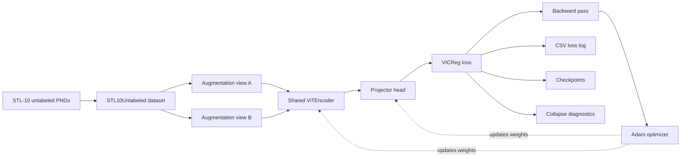
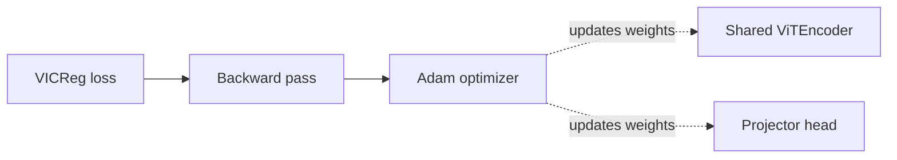

# Project Architecture and World-Model Direction

## Overview

This repository is currently a self-supervised vision pretraining project built
around a ViT encoder and the VICReg objective on unlabeled STL-10 images.

The immediate goal is to learn useful visual representations from two
augmented views of the same image without requiring labels. The longer-term
direction is to use this as a stepping stone toward Yann LeCun-style world
models: latent-space systems that learn a structured representation of the
world and predict what happens next, rather than only classifying pixels.

## Current System

### Optimization Path

This separate diagram shows only the weight-update part. It is split out so the main flow stays easy to read.

### How To Read The Diagram

The diagram is showing one training loop.

1. Start with unlabeled STL-10 images.
2. The dataset creates two different augmented views of the same image.
3. Both views go through the same encoder and projector.
4. The VICReg loss compares the two projected outputs.
5. The backward pass updates the encoder and projector through the optimizer.
6. The loop repeats for the next batch.

The circles and return arrows are there because this is not a one-way pipeline.
It is a training loop:

- forward pass
- loss computation
- backward pass
- optimizer update
- next batch

The arrows going back to `ViTEncoder` are not data flowing backward.
They mean the encoder weights are updated during training.

### Purpose Of Each Neural Network

This project has two neural networks in the main training path.

1. `ViTEncoder`
   - Input: one image view
   - Output: a feature vector
   - Purpose: learn the main representation of the image
   - Why it matters: this is the part you want to keep and reuse later for probing, retrieval, and downstream tasks

2. `Projector`
   - Input: encoder features
   - Output: projected features used by the VICReg loss
   - Purpose: give the loss its own space to work in
   - Why it matters: the projector helps training without forcing the encoder representation itself to become too specialized to the loss

Important:

- the encoder is the part we care about most after training
- the projector is mainly a training helper
- the optimizer updates both during training
- later, for probing or retrieval, we usually freeze the encoder and ignore the projector

## Solution Architecture

### 1. Data layer

- Source: Kaggle STL-10 unlabeled PNG folder under `data/archive/unlabeled_images`
- Contract: one image in, two independently augmented views out
- Purpose: provide paired views for self-supervised learning without labels

Relevant code:

- [`src/jepa_world_models/data/stl10.py`](../src/jepa_world_models/data/stl10.py)
- [`src/jepa_world_models/contrastive_learning/augmentations.py`](../src/jepa_world_models/contrastive_learning/augmentations.py)

### 2. Representation encoder

- Backbone: small Vision Transformer
- Input: `3 x 96 x 96` images
- Patch size: `8`
- Output: one `embed_dim` vector per image
- Role: produce the shared visual representation that downstream learning shapes

Relevant code:

- [`src/jepa_world_models/contrastive_learning/encoders/vit.py`](../src/jepa_world_models/contrastive_learning/encoders/vit.py)
- [`src/jepa_world_models/contrastive_learning/encoders/patch_embedding.py`](../src/jepa_world_models/contrastive_learning/encoders/patch_embedding.py)
- [`src/jepa_world_models/contrastive_learning/encoders/attention.py`](../src/jepa_world_models/contrastive_learning/encoders/attention.py)
- [`src/jepa_world_models/contrastive_learning/encoders/transformer_block.py`](../src/jepa_world_models/contrastive_learning/encoders/transformer_block.py)

### 3. Projector head

- Architecture: 3-layer MLP with BatchNorm and ReLU
- Role: transform encoder outputs into the space where VICReg is applied
- Design intent: keep the regularization pressure on the projector while
  preserving encoder features for downstream transfer

Relevant code:

- [`src/jepa_world_models/contrastive_learning/projector.py`](../src/jepa_world_models/contrastive_learning/projector.py)

### 4. Objective function

- VICReg combines:
  - invariance: aligned views should match
  - variance: avoid dead dimensions
  - covariance: avoid redundant dimensions
- This prevents trivial collapse while learning semantically stable features

Relevant code:

- [`src/jepa_world_models/vic_reg_loss/loss.py`](../src/jepa_world_models/vic_reg_loss/loss.py)

### 5. Training orchestration

- Builds the dataset, model, optimizer, and loss
- Runs mixed-precision training
- Logs per-step loss components to CSV
- Saves periodic, best, and final checkpoints
- Exposes the full run through a single CLI entry point

Relevant code:

- [`src/jepa_world_models/vic_reg_loss/train.py`](../src/jepa_world_models/vic_reg_loss/train.py)
- [`scripts/run_training.py`](../scripts/run_training.py)

### 6. Analysis and debugging tools

This repo is built for inspection, not just execution. The scripts are part of
the architecture because they make failure modes visible.

- `scripts/plot_loss_curves.py`: tracks whether training is healthy or
  collapsing
- `scripts/diagnose_collapse.py`: fast iterative debug run on real data
- `scripts/profile_throughput.py`: separates data-loading time from GPU compute
- `scripts/visualize_augmentations.py`: confirms the two-view transform pipeline

## How The Pieces Fit Together

1. `STL10Unlabeled` loads one image and applies the augmentation pipeline twice.
2. The two views are passed through the same ViT encoder and projector.
3. VICReg computes three terms over the projector outputs.
4. Backprop updates the shared encoder and projector weights.
5. Logs and checkpoints capture the run so collapse or instability can be
   diagnosed after the fact.

## Why This Is A Good Hiring-Manager Demo

This project shows more than a model implementation:

- a clear self-supervised learning objective
- a custom data pipeline for unlabeled image data
- a transformer backbone implemented from first principles
- explicit handling of collapse, logging, checkpointing, and profiling
- a reproducible training entry point and test suite

For an imaging team, the important signal is that the system is built to learn
robust visual embeddings from raw imagery without labels.

## Where This Sits Relative To Yann LeCun's World Models

Yann LeCun's world-model direction is broadly about learning internal latent
representations that capture how the world works, then predicting future or
missing latent states instead of raw pixels.

In that framing:

- the encoder learns a compact latent state
- the predictor learns structure over that state
- the objective rewards semantic consistency, not label prediction
- the system is meant to support planning, reasoning, and control later

This repo is not a full world model yet. It is closer to the representation
learning foundation you would want before adding:

- masked latent prediction
- temporal prediction over video or sequences
- action-conditioned dynamics
- target encoders / bootstrapped prediction
- planning or control heads

## What LeCun Means By "World Models"

The core idea is:

- build a latent space that describes the environment compactly
- predict in latent space rather than pixel space
- avoid spending model capacity on reconstructing irrelevant detail
- learn representations that are useful for downstream decision making

Compared with standard supervised learning, the focus shifts from "predict the
label" to "model the structure of the world".

Compared with raw generative modeling, the focus shifts from pixels to meaning.

## Practical Next Step

If the goal is to evolve this repo toward LeCun-style world models, the next
architectural step is usually one of these:

1. extend the image pipeline into video or trajectory data
2. add a latent predictor on top of the encoder
3. move from invariance-only pretraining toward masked or future-state
   prediction in latent space
4. keep the current diagnostics, since collapse and representation drift will
   still matter

## Repository Summary

Current state:

- self-supervised STL-10 representation learning
- ViT + projector
- VICReg objective
- strong training diagnostics

Target direction:

- latent world modeling
- predictive representation learning
- eventually a system aligned with LeCun-style JEPA / world-model ideas
